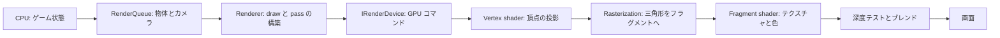
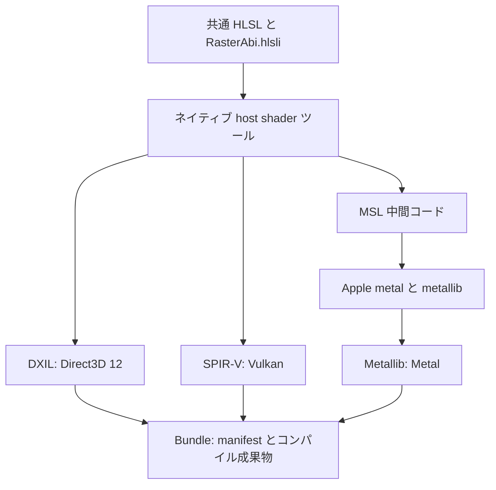
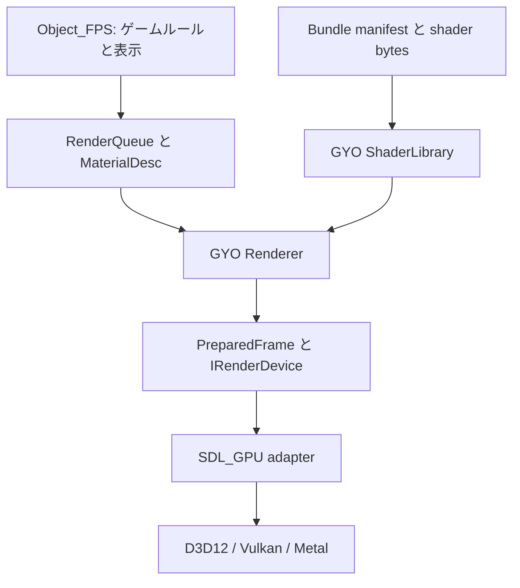

# GYO レンダリング設計とクロスプラットフォームビルド

[繁體中文](rendering_architecture.zh-Hant.md) · [全体設計](architecture.md)

両言語で章番号、コードの識別子、図の構成を揃えています。本書は今回の実装の責務を説明します。実際の検証状況は第 10 節を参照してください。

<a id="r01"></a>
## 1. 1 フレームが画面になるまで

CPU はゲームのルールを実行して何を描くかを決め、GPU は頂点と画面のフラグメントを並列処理します。Shader は GPU で動く小さなプログラムであり、レンダラー全体ではありません。



Mark-23 では、CPU がボーンアニメーションを評価し、スキニング後の頂点を既存の GPU mesh に転送します。Vertex shader が頂点を画面座標へ変換し、fragment shader が UV を使ってテクスチャの色を読みます。深度テストは指と銃の前後関係を決め、背面カリングは三角形のどちら側を表示するかを決めます。これらの固定パイプライン設定は C++ の pipeline 記述が管理します。

図は概念的な順序です。GPU は一部の深度テストを早期に実行できます。現在のモデルスキニングは CPU 処理であり、GPU ボーンアニメーションや完全な PBR ライティングはありません。

<a id="r02"></a>
## 2. 共通 HLSL から各プラットフォーム形式へ

HLSL はソース言語で、DXIL、SPIR-V、Metallib は各バックエンドが受け取るコンパイル成果物です。GYO は共通の HLSL を維持し、ビルド時に必要な形式を生成します。ゲーム起動時に HLSL をコンパイルしません。



ツールはバージョン固定の DXC、SDL_shadercross、SPIRV-Cross を使います。固定値とチェックサムは `tools/shader_pipeline/cmake/Dependencies.cmake` にあります。Windows／Linux は固定 DXC 配布物を利用し、macOS は固定 DXC ソースをネイティブビルドした後、選択した Xcode のツールで Metallib を生成します。MSL は中間成果物であり、MSL の生成だけで Metal の GPU 検証を完了したとは扱いません。

Shader ツールはビルドを実行する host 用、ゲームは実行先の target 用です。ネイティブビルドでは build tree の `host-tools` にツールを構築します。クロスコンパイル時は host 上で実行できる `GYO_SHADER_TOOL_EXECUTABLE` を指定します。取得物、ツール、中間コード、bundle は build tree に置きます。配布したゲームに DXC、shadercross、Xcode は不要です。

<a id="r03"></a>
## 3. 責務とデータの流れ



| 要素 | 担当すること | 担当しないこと |
|---|---|---|
| Object_FPS | 物体、カメラ、材質の shader ID、武器動作 | SDL_GPU コマンド、shader 形式の選択 |
| `RenderQueue`／`MaterialDesc` | 中立な形状、材質、描画要求 | Native handle、ファイルのコンパイル |
| `ShaderLibrary` | bundle の原子的な追加、manifest の検証、不変 shader bytes の保持 | GPU pipeline やテクスチャの生成 |
| `Renderer` | カメラと行列、世界／武器／後処理／HUD の順序、pipeline 選択と画面リソース | ドライバーの詳細、ゲームの命中判定 |
| `IRenderDevice` | GPU リソース、pipeline、frame の取得／送信、読み戻し契約 | 銃やシーン固有の方針 |
| SDL_GPU adapter | 中立な契約を SDL_GPU 操作と同期へ変換 | ゲームの pass 構築、HLSL ソースの埋め込み |

これは交換可能な C++ API の境界です。コンパイラーをまたぐ動的プラグイン ABI は保証しません。`ShaderLibrary` の CPU データは共有できますが、GPU handle、pipeline、実行中リソースは device ごとに管理します。

<a id="r04"></a>
## 4. Shader のデータ契約：`gyo.raster.v1`

同じ HLSL がコンパイルできても、CPU が渡すバイト列と shader の読み方が一致しなければ正しく描画できません。

| 項目 | 契約 |
|---|---|
| 座標 | 左手系、+Y が上、+Z が前。行列は row-major、ベクトルは row vector |
| 頂点 | `Vertex3D`：位置 float3、UV float2。順序と offset は固定 vertex layout で定義 |
| 通常の vertex uniform | `worldViewProjection`：64 bytes、vertex ステージの論理 uniform スロット 0 |
| 通常の fragment リソース | テクスチャと sampler が各 1 個、fragment ステージの論理スロット 0 |
| 通常の fragment uniform | tint、UV scale/offset、alpha パラメーター：float4 が 3 個、48 bytes、fragment の論理 uniform スロット 0 |
| シーン後処理 uniform | exposure と gamma を float4 に格納、16 bytes、fragment の論理 uniform スロット 0 |
| 色 | 線形 RGB で計算し、色テクスチャを sRGB デコード。最後に sRGB render target が表示用変換 |

`render/shaders/common/RasterAbi.hlsli` に共通 HLSL 宣言を置きます。コンパイルツールはリフレクションで対応インターフェースのリソース数と uniform サイズを検証し、契約と形式の情報を manifest に記録します。バージョン不一致、欠けたプログラム、不完全な形式、ID 重複、不正パスは明示的に失敗し、別の shader に置き換えて隠しません。

共通宣言は論理リソースマクロを使い、公開 ABI に SDL の register／descriptor 規則を固定しません。ツールの SDL_GPU profile が、vertex uniform を `b0/space1`、fragment texture／sampler を `t0/space2`／`s0/space2`、fragment uniform を `b0/space3` に割り当て、SPIR-V／Metal への対応も処理します。Device adapter を交換するときの物理バインドはツールと adapter の責務です。

今回対応するインターフェースは `unlit` と `scene_post` です。カスタム shader は既存データ契約の範囲で色計算を変更できます。頂点属性、追加 texture、新しい意味の uniform を増やす場合は、中立インターフェース、反射検証、Renderer の値設定も拡張します。

<a id="r05"></a>
## 5. 内蔵 shader とゲーム shader の所有権

| Shader ID | 所有者 | 用途 |
|---|---|---|
| `builtin/unlit` | GYO Render | mesh と sprite のテクスチャ、tint、alpha cutoff |
| `builtin/scene_post` | GYO Render | シーンの exposure と gamma |
| `game/object_fps/channel_swap` | Object_FPS | 同じ `unlit` 契約を使うカスタム shader の検証用サンプル |

内蔵ソースは `render/shaders/builtin/`、ゲームのソースは `apps/object_fps/shaders/` に置きます。それぞれ `bundle.json` ビルド仕様と独立した runtime bundle を持ちます。ゲームの shader ID を増やしても、GYO バックエンドにゲーム名やファイルパスを埋め込む必要はありません。

`MaterialDesc` は shader ID でプログラムを指定し、texture、tint、sampler を渡します。Shader ID は C++ 関数ポインターではなく、shader がゲーム状態を変更する権限も持ちません。データ設定で選べるのはエンジンが対応済みの能力です。

例えば `apps/object_fps/shaders/bundle.json` では各ステージのエントリーポイントを明示します。省略時は `main` です。

```json
{
  "version": 1,
  "include_directory": "../../../render/shaders/common",
  "programs": [{
    "id": "game/object_fps/channel_swap",
    "interface": "unlit",
    "vertex": "../../../render/shaders/builtin/unlit.vert.hlsl",
    "vertex_entrypoint": "main",
    "fragment": "channel_swap.frag.hlsl",
    "fragment_entrypoint": "main"
  }]
}
```

HLSL の入口名と成果物の入口名は必ずしも同じではありません。例えば MSL 変換時に変更される場合があります。ツールは実際の成果物の入口を runtime manifest に記録し、Renderer/device はその値を使います。

<a id="r06"></a>
## 6. フレームとリソースのライフサイクル

```text
World meshes + Scene sprites
        ↓ シーンの色を保持して深度をクリア
ViewModel meshes
        ↓ シーンの exposure／gamma
Scene post process
        ↓ シーンの exposure の影響を受けない
Overlay / HUD → Present
```

世界と武器は別のカメラを使います。武器 pass で深度をクリアしても、手と銃の間の遮蔽は保たれます。`Renderer` が `PreparedFrame` を構築し、device は明示された pass、attachment、draw を実行します。

最小化中の `AcquireFrame` は frame なしを返せます。取得できた token は `SubmitFrame` または `AbandonFrame` で一度だけ消費します。送信時の CPU データは呼び出し中に消費し、GPU がまだ使うリソースの保護はバックエンドが担当します。画面サイズ変更時は render target を再生成し、終了時は Renderer の device リソースを解放してから device を破棄します。

アニメーションは固定サイズの頂点内容を更新し、mesh handle と index topology を維持します。診断の読み戻しは明示要求時だけ GPU を待ち、通常の表示ではこの同期を行いません。Scene capture は exposure／gamma／Overlay より前のシーンであり、最終スクリーンショットではありません。

<a id="r07"></a>
## 7. CMake の自動選択と明示的な上書き

| 設定 | 値 | 意味 |
|---|---|---|
| `GYO_RENDER_DEVICE` | `AUTO`／`SDL_GPU`／`NONE` | device 実装。`NONE` は GPU なしのビルド用 |
| `GYO_GPU_DRIVER` | `AUTO`／`D3D12`／`VULKAN`／`METAL` | 配布プログラムのデフォルトドライバー方針 |
| `GYO_SHADER_BUNDLE` | `AUTO` または形式リスト | ビルド・配布する shader 形式。例：`"DXIL;SPIRV"` |
| `GYO_SHADER_TOOL_EXECUTABLE` | host executable の絶対パス | クロスコンパイルなどで使うネイティブ shader ツールの上書き |

| ターゲット | `AUTO` の shader bundle | 対応ドライバー |
|---|---|---|
| Windows | DXIL＋SPIR-V | D3D12、Vulkan |
| Linux | SPIR-V | Vulkan |
| macOS | Metallib | Metal |

CMake は `CMAKE_SYSTEM_NAME` で**ターゲット**を判定します。Preset の `hostSystemName` 条件は CI のネイティブビルド入口を制限するだけです。実行時の `--gpu-driver d3d12|vulkan|metal` でドライバーを指定できます。AUTO は提供可能な完全な shader 形式と SDL_GPU の利用可能なドライバーで選択します。強制指定したドライバーが使えない場合、他のドライバーで問題を隠さず失敗します。

Windows の AUTO bundle は DXIL／SPIR-V の両方を含むので、両ドライバーを検証できます。DXIL だけの package は Vulkan に切り替えられません。矛盾するターゲット／ドライバー／形式の組み合わせは配置時または起動時に拒否します。CMake だけでは利用者の GPU とドライバーの動作まで保証できません。

```sh
# ネイティブビルド。Windows は先に x64 MSVC 開発環境を開き、Ninja も用意する。
cmake --preset object-fps
cmake --build --preset object-fps
ctest --preset object-fps
cmake --install build/object-fps --prefix /absolute/path/to/stage

# ゲーム、SDL adapter、FBX adapter を含めない core ビルド
cmake --preset core
cmake --build --preset core
ctest --preset core
```

`object-fps` test preset は `cpu|shader` ラベルだけを実行します。GPU テストは使用可能なディスプレイと GPU を持つ環境で別途実行します。`ci-windows`、`ci-linux`、`ci-macos` は CI 用のコンパイラー／アーキテクチャを明示します。

CLion では既存の MSVC CMake profile を使い、**Reload CMake Project** を実行してから `gyo_object_fps` target を選んで実行します。ネイティブ shader ツールの子ビルドは、その profile で選択したコンパイラーと Ninja のパスを引き継ぎます。再配布 DLL の検出のために IDE profile を作り直す必要はありません。

macOS CI package の deployment target は **13.3** を維持し、ゲームと Metallib に同じ値を使います。最低実行 OS バージョンと SDK が API を提供するかどうかは別の条件です。Xcode 16.4 には浮動小数点 `std::from_chars` の overload がないため、CSV は十進数／指数の構文を明示的に検査し、`std::locale::classic()` で float に変換します。有限値、範囲、非ゼロ値のゼロへのアンダーフロー、文字列全体の検査を維持し、表現可能な非正規化数も扱います。システムのロケールは小数点の解釈に影響しません。

Ubuntu では SDL が既定で有効にする XTest の検出用に `libxtst-dev` が必要です。CI は `pkg-config --modversion xtst` で確認します。オフライン shader ツール用 SDL は video と dialog の両方を無効にし、macOS の静的リンクで未ビルドの Cocoa window symbol を参照しないようにします。ゲーム用 SDL の設定は host ツールとは独立しています。[SDL Linux 依存パッケージ](https://wiki.libsdl.org/SDL3/README-linux#build-dependencies)

オフライン host ツールは `SDL_UNIX_CONSOLE_BUILD=ON` も明示します。X11／Wayland video を意図的に使わないため、console build であることを SDL に伝える必要があります。指定しないと Linux configure は video backend の不在をエラーとします。この設定は shader host 用 SDL だけに適用し、ゲームは独自のグラフィックス backend をビルドします。

<a id="r08"></a>
## 8. 配布とファイル欠落時の処理

```text
stage/
├─ bin/
│  ├─ gyo_object_fps[.exe]
│  ├─ gyo_ui_editor[.exe]
│  ├─ assets/common/ + assets/object_fps/
│  ├─ shaders/builtin/manifest.json + shader artifacts
│  └─ shaders/object_fps/manifest.json + shader artifacts
└─ lib/  Linux／macOS の非システム動的ライブラリ（Windows DLL は bin/）
```

実行ファイルの位置から配布データを解決し、カレントディレクトリに依存しません。`--validate-package` はウィンドウや GPU を作らず、配布 asset、shader bundle、読み込みを検証します。CI は独立した一時ディレクトリに複製して起動し、common asset、内蔵 shader manifest、ゲーム shader manifest を一時的に取り除いて各失敗を確認します。ソースディレクトリのファイルで欠落を隠さないためです。

GitHub artifact は Unix の実行権限を保つ tar.gz と SHA-256 チェックサムを含みます。実機確認用のネイティブ package であり、macOS 署名／公証や Linux ディストリビューション間の互換性は保証しません。Linux package は実行先のグラフィックスドライバーとシステムライブラリを利用します。

`build_metadata.json` は `source_revision`、`platform`、`ci_smoke` を記録します。Quick CI の package は3プラットフォームの起動確認と Linux の shader 描画1件を記録します。Release package は、さらに3プラットフォームの gameplay headless smoke と Linux Lavapipe の描画8件すべての合格を必要とします。Package ツールは commit／platform が異なる報告を拒否します。Release アップロード前にこの情報、アーカイブ内容、SHA-256 を再検証します。Quick CI や通常のローカル package は、完全な Release 検証に合格した入力には使えません。

Windows package は Release／RelWithDebInfo を使い、`cmake/GyoMsvcRuntime.cmake` が選択したコンパイラーのインストール位置から対応する MSVC 再配布可能 DLL を探し、`bin/` に配置します。IDE 同梱 CMake の Visual Studio バージョン一覧には依存しません。`GYO_MSVC_REDIST_DIR` で再配布ファイルのルートを指定することもできます。DLL が見つからなくても開発用 configure／build は続行でき、release install の時点で不足と対処方法を報告します。Debug CRT は配布せず、今回の package は Windows 10+ のシステム UCRT を前提にします。ゲームの実行に Visual Studio、shader コンパイラー、SDK は不要です。

CI は `dumpbin` で Windows EXE/DLL の参照する VC runtime が同梱されていることを確認します。Linux は `ldd` で SDL3 が package の `lib/` に解決されること、macOS は `otool` で相対 install name と RPATH を確認します。これらはビルド機の検証ツールです。Windows で `tools/ci/validate_package.py` を実行する際は `--dumpbin /absolute/path/to/dumpbin.exe` で指定できます。

<a id="r09"></a>
## 9. Object_FPS の CI、Release、実機受け入れ確認

### 9.1 毎回の push で必要な検証

GitHub Actions は Windows x64／MSVC、Ubuntu 24.04 x64／GCC 14、macOS 15 ARM64／Xcode 16.4 で Object_FPS、UI editor、shader をビルドします。3 job は独立しており、1 つの失敗で他を停止しません。ログ、manifest、ネイティブ package をアップロードします。

ブランチ push、pull request、**Run workflow** は quick 経路で、コンパイル、実際の内容による起動確認、shader 描画1件を実行します。完全なゲームルールと8件の描画検証は Release イベントで実行します。`v*` tag push も Release 経路です。

```text
prepare: イベントと固定 commit の検証
  → Windows／Linux／macOS: build + install + startup smoke
  → Release のみ: CPU/headless + shader + core-only + 独立配布の失敗検証
  → Release のみ: 3プラットフォーム gameplay headless
  → Linux Vulkan/Lavapipe: quick は shader 1件／Release は全8件
  → 3プラットフォーム: package + SHA-256 + Actions artifacts
  → CI validation: 3プラットフォームすべて成功
  → 公開イベントのみ: 3プラットフォームの Release assets を検証・アップロード
```

| 検証 | Platform | 実際の範囲 |
|---|---|---|
| `--startup-smoke-test` | Windows／Linux／macOS、quick と Release | 別の作業ディレクトリーから配布版を起動し、catalog／campaign／FBX モデルの構成を実際に読み込む。ウィンドウと GPU は作らない |
| `manual_gpu_smoke.py --suite quick` | Linux、quick CI | Xvfb の表示環境で Mesa Lavapipe Vulkan を強制選択し、カスタム shader の赤／青描画と読み戻しを1回実行 |
| `--headless-smoke-test` | Windows／Linux／macOS、Release のみ | メニュー、開始、取り出し、ジャンプ、一時停止／再開、着地、1回の射撃、リロード完了も検査。ウィンドウと GPU は作らない |
| `manual_gpu_smoke.py --suite full` | Linux、Release のみ | shader、世界、メニュー、武器、リロード、3比率の銃口診断、計8件 |
| 物理 GPU／対話操作 | 各プラットフォームの実機 | 全8件の GPU 診断と手動操作。Windows／macOS の hosted runner はこの項目の合格を主張しない |

Linux で Lavapipe がない場合、device の生成失敗、描画失敗、タイムアウトはいずれも job の失敗になります。「GPU がなければスキップして成功」とする経路はありません。Helper はログに記録された実際の driver／shader 形式が要求と一致することも確認し、`summary.json` に結果を保存します。`vulkan-info.log` は ICD と Vulkan device 情報を記録します。これでソフトウェア Vulkan の描画経路を確認し、物理 GPU は別途検証します。

固定名の `CI validation` job が `prepare` と3プラットフォームの matrix を集約します。必須 job の失敗、キャンセル、スキップは合格にならず、branch protection の必須チェックに指定できます。Quick 経路では設計どおり Release 専用の重い処理を実行せず、Summary にモードと未実行項目を明記します。これらを完全な検証済みとは扱いません。

### 9.2 Release イベントとアップロード方針

| イベント | 3プラットフォームのビルドと smoke | Release 添付 |
|---|---|---|
| ブランチ push、pull request | Quick 経路 | アップロードせず、Actions artifacts を保存 |
| 手動 **Run workflow** | Quick 経路 | tag を選択した手動実行でもアップロードしない |
| `v*` tag push | 完全な Release 経路 | 全件成功後、その tag の Release を作成／利用してアップロード |
| GitHub **Publish release**（`release.published`） | 完全な Release 経路 | 全件成功後、その Release に追加。正式版とプレリリースの両方が対象 |
| Release の下書き保存 | 起動しない | アップロードしない |

公開には tag がイベントの正確な commit を指し、その commit がデフォルトブランチの履歴に含まれることが必要です。3プラットフォームの検証がすべて成功した場合にのみ publisher に進み、この job だけが `contents: write` を持ちます。添付は `gyo-object-fps-{windows-x64,linux-x64,macos-arm64}.tar.gz` と各 `.tar.gz.sha256`、計6ファイルです。

同じ tag の push と Release イベントはロックを共有し、実行中の公開をキャンセルしません。重複イベントも再ビルド・再検証します。アップロード時にリモート tag、ファイルのハッシュ、ソース／smoke 情報を再確認し、検証済みの添付を保持して不足分だけを追加します。競合はエラーになり、既存添付を上書きせず、利用者が書いた Release のタイトルや説明も変更しません。通常のブランチ／PR の古い実行は、新しい実行でキャンセルできます。

### 9.3 ダウンロード後の実機確認

Actions artifacts または Release から対応 package をダウンロードし、tar.gz を展開して、グラフィカルデスクトップのある実機で実行します。

```sh
python manual_gpu_smoke.py --package /absolute/path/to/gyo-object-fps \
  --driver vulkan --suite full --output /absolute/path/to/diagnostics
```

macOS は `--driver metal`、Windows は `--driver d3d12` と `--driver vulkan` をそれぞれ確認します。Python helper はカスタム shader の赤／青ピクセル読み戻し、世界、メニュー、武器、Reload 全体、16:9／4:3／21:9 の銃口投影 smoke を実行し、終了コード、ログ、診断画像を保存します。各項目の制限は 120 秒です。Python がない場合は `bin/gyo_object_fps --gpu-driver metal --muzzle-smoke-test --capture-dir /absolute/path/to/captures` などを直接実行できます。

`--suite full` はデフォルトの全8件、`--suite quick` は shader 描画1件です。`--suite ci` は shader、world、menu の3件を手動で選ぶために残しています。`--timeout` は各項目の秒数上限です。1件でも失敗すると helper は非ゼロで終了しますが、残りのケースも実行して結果を保存します。

制限環境で Python の一時ディレクトリーを利用できない場合、両方の検証 helper に `--work-directory /absolute/path/to/new-work` を指定できます。このディレクトリーは未作成である必要があり、検証後も調査用に残ります。配布検証では `--stage` の外側を指定します。

手動ではマウス／キーボード、Space ジャンプ、R リロード、H 収納／取り出し、指と銃の遮蔽、壁際の射撃、exposure と HUD、リサイズ／最小化、UI editor を確認します。OS、CPU アーキテクチャ、GPU／ドライバー、package の commit、要求した／実際のバックエンド、`summary.json` を添えて報告すると、ビルド・データ・GPU のどの問題かを区別できます。

実機でソースからビルドした場合は `ctest --test-dir build/object-fps -L gpu --output-on-failure` で engine＋game の GPU テスト全体を実行できます。独立した `render.sdl_gpu_mesh_smoke` は、UV／部分矩形、深度とカリング、sRGB／線形色、alpha、非対称行列、13×7 後処理も読み戻し値で検証します。このテスト executable は Object_FPS のダウンロード package には含めません。

<a id="r10"></a>
## 10. 検証状況、制限、参考資料

2026-09-16 時点の、今回の実装に対するローカル検証結果です。

| 検証 | 状態 |
|---|---|
| Windows のゲーム／optional adapter なし core 構成 | CTest 6/6 合格。実際の CMake プラットフォーム方針と中立 render テストを含む |
| Windows ネイティブ shader host ツール | CLion profile の CTest 3/3 合格。反射、不正 shader 拒否、増分依存、再ビルド、子ツールチェーンの引き継ぎを含む |
| 主ビルドからの host shader ツール自動構築 | 成功 |
| Windows 全体の RelWithDebInfo ビルドと CPU/headless | ビルド成功、CTest 12/12 合格。headless は 1,169 assertions を含む |
| Windows RelWithDebInfo の engine GPU 数値 smoke | D3D12 と Vulkan の明示指定で両方 exit 0。実際の構成は `direct3d12`＋DXIL、`vulkan`＋SPIR-V |
| Windows Object_FPS GPU 検証 | D3D12、Vulkan ともに 8/8 ケース合格。両 helper が exit 0 で summary を保存 |
| Windows 配布検証 | 完全な package は成功。common、組み込み shader、ゲーム shader の欠落 3 ケースは正しく失敗。app-local CRT の依存関係検査も合格 |
| Object_FPS の `NONE` 構成 | 存在しない shader ツールを指定してもビルド成功。43 target に SDL_GPU、shader host、bundle はなく、headless／render 2/2 合格 |
| CLion の既存 MSVC profile | CMake 4.1.2＋Ninja＋VS18 cl 14.51 Release。元の `cmake-build-msvc` で configure、host ツール自動構築、Object_FPS／UI editor ビルド成功 |
| CLion 回帰・配布検証 | CMake 方針／CRT 2/2、headless／render／package／CRT 4/4、ゲーム／メニュー／shader GPU 3/3 合格（`direct3d12`＋DXIL）。release install、独立 package、3 欠落ケース、CRT 検査も合格 |
| 今回の CI 互換性修正のローカル回帰 | Windows Object_FPS と host ツールの再ビルド成功。CMake／render／headless／package／GPU 合計 7/7、host 3/3。CSV 専用検証は MSVC と MinGW GCC で各 192 assertions 合格 |
| GitHub Windows x64 | 以前の全体 CI は合格。最新 quick run 35097049659 はビルド、インストール、startup が成功したが、MSVC が `PLATFORM=x64` に上書きして archive 引数が失敗。`GYO_PACKAGE_PLATFORM` に変更済み、次の CI 待ち |
| GitHub Linux／macOS core-only | 両 platform とも 7/7 合格 |
| GitHub Linux ビルドと quick smoke | run 35097049659 はビルド、配布版 startup、Lavapipe の shader 描画1件、package に成功。以前の XTest／console-build 問題は解消 |
| GitHub macOS 全体ビルド | run 35093916457 は CPU/headless/shader 13/13、host shader 3/3、core-only 7/7、Metallib、インストール、配布検証に合格。最新 quick run の macOS 結果は未確認 |
| Linux／macOS 物理 GPU 検証 | 各 platform の実機実行待ち。Linux のソフトウェア Vulkan quick smoke は合格 |
| 新 smoke helper のケースと失敗経路 | 実際の subprocess を使う8件が合格。quick の1件限定、非ゼロ終了、タイムアウト、起動失敗、GPU 未作成で exit 0、driver／shader 不一致、結果の集約を検証 |
| CI helper 全体と workflow の静的検査 | 公開方針、package 内容、smoke を含む helper 49件に合格。actionlint 1.7.12 と `git diff --check` も合格 |
| 新 helper と既存 Windows package | ローカルの D3D12／DXIL と Vulkan／SPIR-V で `--suite ci` が各 3/3、Vulkan の `--suite quick` が 1/1 合格。既存 package での確認であり、新 hosted フローの合格証拠ではない |
| 新 Windows 実行ファイルの CPU 回帰 | MSVC 再ビルド成功。startup smoke、gameplay headless smoke、package、domain headless が計 4/4 合格。無効な SDL video／GPU driver を指定し、ウィンドウや GPU が不要であることを確認 |
| 新 Windows インストール済み package | TEMP 作業ディレクトリーから startup／gameplay smoke に合格。通常の配布検査と common／builtin shader／game shader の3欠落検査が期待どおり。Vulkan `full` 8/8、D3D12 `quick` 1/1 合格 |
| 新 push／Release フロー | Quick 経路を GitHub で実行し、Linux は成功。Windows package の修正は次の実行待ち。完全な Release 経路は未検証 |

既存の Windows Mark-23／ジャンプ検証を、新レンダリング設計の検証結果として流用しません。今回のビルドログ、Actions summary、実機出力を合格の証拠とします。

初回 hosted の記録は [Actions run 35079389797](https://github.com/yojinn-io/GYO-Engine/actions/runs/35079389797) です。この実行は修正前の commit を使っています。古い job の再実行も同じ版を使うため、修正を commit／push し、新しい commit で検証を開始します。

後続は [Actions run 35093916457](https://github.com/yojinn-io/GYO-Engine/actions/runs/35093916457) です。Windows と [macOS job](https://github.com/yojinn-io/GYO-Engine/actions/runs/35093916457/job/104786488372) は成功し、macOS は Metallib、全テスト、配布検証を含みます。Linux ログはオフライン SDL の console-build 設定不足を示しました。どちらも新 quick／Release フローを導入する前の履歴であり、macOS の物理 GPU は未検証です。

最新 [quick run 35097049659](https://github.com/yojinn-io/GYO-Engine/actions/runs/35097049659) は Linux の startup、shader 描画、package を検証しました。Windows の MSVC 初期化はツールチェーン用の `Platform=x64` を設定し、Windows 環境変数は大文字・小文字を区別しません。Package の識別には `GYO_PACKAGE_PLATFORM=windows-x64` を使い、報告と archive 引数への影響を避けます。

上記 engine GPU smoke は frame のライフサイクル、動的 mesh、ViewModel 深度、カリング、UV、行列投影、alpha ブレンド、色処理を実際に検証しています。Object_FPS は両ドライバー、3 アスペクト比、各 7 カメラ条件で、銃口／tracer マーカーの中心差が 0.0000 ピクセル、数値参照投影との最大誤差が 0.3823 ピクセルでした。

Windows のプラットフォーム変数修正は、ローカルで MSVC を初期化した後に workflow の startup／archive ブロックを直接実行して確認しました。アーカイブ名、埋め込まれたプラットフォーム情報、SHA-256 はすべて合格です。記録は `build/ci-platform-env-check/result.log` にあり、修正後の GitHub 結果は新しい commit の CI で確認します。

ローカルのビルドは `build/render-cross-vs18`、package はその `stage` にあります。`ctest --test-dir build/render-cross-vs18 -C RelWithDebInfo -L cpu --output-on-failure` で再検証でき、GPU と配布には第 8、9 節の helper を使います。今回の証拠は次の場所に保存しています。

- `build/render-cross-vs18/cpu-tests.xml`、同ディレクトリーの `gpu-d3d12/summary.json`、`gpu-vulkan/summary.json`。GPU サブディレクトリーには各ケースのログと BMP も保存。
- `build/render-cross-vs18/package-logs/package-*.log`：完全 package、3 つの欠落ケース、CRT の依存関係検査。
- `build/render-cross-vs18/validation-none-{configure,build,ctest,restore}.log`：バックエンド無効化と AUTO 復帰の確認。
- `build/render-neutral-vs18/test-results.xml`、`build/shader-host-vs18/Testing/Temporary/LastTest.log`：独立 core と host ツールの検証。
- `build/clion-configure.log`、`build/clion-build.log`、`build/clion-regression-tests.log`、`build/clion-host-tests.log`、`build/clion-gpu-tests.xml`、`build/clion-package-logs/`：既存 CLion profile の修正検証。
- `build/ci-portability-build.log`、`build/ci-portability-tests.xml`、`build/ci-portability-host-tests.xml`：今回の Linux／macOS CI 互換性修正に対する Windows 回帰。元の失敗ログは `build/ci-35079389797-logs/`。
- `build/ci-35093916457-linux.log`：後続 hosted Linux のオフライン SDL console-build 設定エラー。
- `build/ci-35093916457-macos.log`：後続 hosted macOS のビルド、Metallib、13/13＋3/3＋7/7 テストと配布の成功記録。
- `build/ci-smoke-support/windows-{d3d12,vulkan}/summary.json`：新 helper と既存 Windows package による3件の診断。
- `build/ci-smoke-support/windows-vulkan-quick/summary.json`：新 quick suite の shader 描画1件。
- `build/ci-release-smoke-tests.log`、`build/ci-release-smoke-tests.xml`：新 Windows 実行ファイルの 4/4 CPU 回帰。新しいインストール済み package は `build/ci-release-stage/`。
- `build/ci-release-gpu/vulkan/summary.json`、`build/ci-release-gpu/d3d12-quick/summary.json`：新 package のローカル Vulkan 8件と D3D12 1件の描画検証。Linux Lavapipe の合格証拠ではありません。

今回の範囲は共通 HLSL、オフライン shader bundle、中立な Renderer/device 境界、3 プラットフォームのビルド手順です。Compute shader、GPU skinning、PBR、任意の material graph、shader hot reload、完全な RenderGraph、device-loss 自動復旧、バイナリープラグイン ABI は含みません。

- [SDL_GPU device と shader 形式](https://wiki.libsdl.org/SDL3/SDL_CreateGPUDevice)
- [SDL_GPU shader リソースのバインド規則](https://wiki.libsdl.org/SDL3/SDL_CreateGPUShader)
- [SDL_shadercross](https://github.com/libsdl-org/SDL_shadercross)
- [DXC](https://github.com/microsoft/DirectXShaderCompiler)
- [CMake target system](https://cmake.org/cmake/help/latest/variable/CMAKE_SYSTEM_NAME.html)
- [GitHub hosted runner 仕様](https://docs.github.com/en/actions/reference/runners/github-hosted-runners)
- [Apple Metal Toolchain のインストール](https://developer.apple.com/documentation/xcode/downloading-and-installing-additional-xcode-components)
