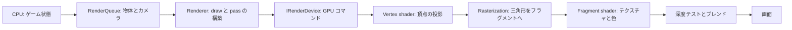
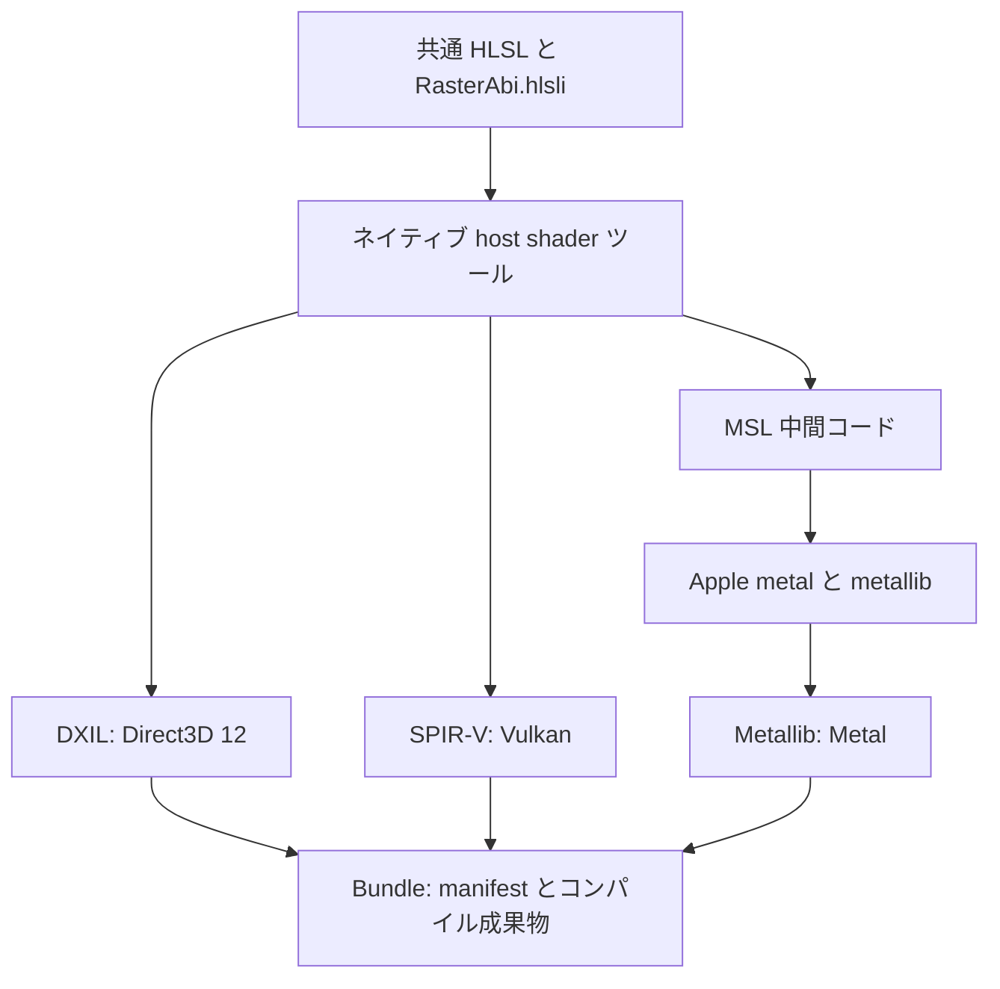
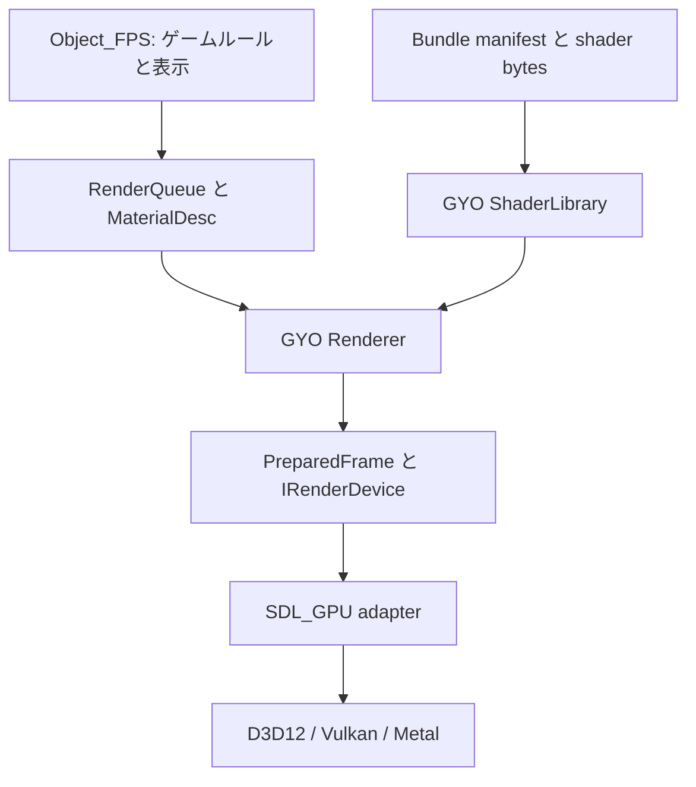

# GYO レンダリング設計とクロスプラットフォームビルド

[繁體中文](rendering_architecture.zh-Hant.md) · [全体設計](architecture.md)

両言語で章番号、コードの識別子、図の構成を揃えています。本書は今回の実装の責務を説明します。実際の検証状況は第 10 節を参照してください。

<a id="r01"></a>
## 1. 1 フレームが画面になるまで

CPU はゲームのルールを実行して何を描くかを決め、GPU は頂点と画面のフラグメントを並列処理します。Shader は GPU で動く小さなプログラムであり、レンダラー全体ではありません。



Mark-23 では、CPU がボーンアニメーションを評価し、スキニング後の頂点を既存の GPU mesh に転送します。Vertex shader が頂点を画面座標へ変換し、fragment shader が UV を使ってテクスチャの色を読みます。深度テストは指と銃の前後関係を決め、背面カリングは三角形のどちら側を表示するかを決めます。これらの固定パイプライン設定は C++ の pipeline 記述が管理します。

図は概念的な順序です。GPU は一部の深度テストを早期に実行できます。現在のモデルスキニングは CPU 処理であり、GPU ボーンアニメーションや完全な PBR ライティングはありません。

<a id="r02"></a>
## 2. 共通 HLSL から各プラットフォーム形式へ

HLSL はソース言語で、DXIL、SPIR-V、Metallib は各バックエンドが受け取るコンパイル成果物です。GYO は共通の HLSL を維持し、ビルド時に必要な形式を生成します。ゲーム起動時に HLSL をコンパイルしません。



ツールはバージョン固定の DXC、SDL_shadercross、SPIRV-Cross を使います。固定値とチェックサムは `engine/render/shaders/pipeline/cmake/Dependencies.cmake` にあります。Windows／Linux は固定 DXC 配布物を利用し、macOS は固定 DXC ソースをネイティブビルドした後、選択した Xcode のツールで Metallib を生成します。MSL は中間成果物であり、MSL の生成だけで Metal の GPU 検証を完了したとは扱いません。

Shader ツールはビルドを実行する host 用、ゲームは実行先の target 用です。ネイティブビルドでは build tree の `host-tools` にツールを構築します。クロスコンパイル時は host 上で実行できる `GYO_SHADER_TOOL_EXECUTABLE` を指定します。取得物、ツール、中間コード、bundle は build tree に置きます。配布したゲームに DXC、shadercross、Xcode は不要です。

<a id="r03"></a>
## 3. 責務とデータの流れ



| 要素 | 担当すること | 担当しないこと |
|---|---|---|
| Object_FPS | 物体、カメラ、材質の shader ID、武器動作 | SDL_GPU コマンド、shader 形式の選択 |
| `ModelRenderer` | モデル／材質の共有、実例ごとの CPU スキニング、動的 mesh の更新と解放 | アニメーション時計、骨格の命中領域、ゲーム状態 |
| `RenderQueue`／`MaterialDesc` | 中立な形状、材質、描画要求 | Native handle、ファイルのコンパイル |
| `ShaderLibrary` | bundle の原子的な追加、manifest の検証、不変 shader bytes の保持 | GPU pipeline やテクスチャの生成 |
| `Renderer` | カメラと行列、世界／武器／後処理／HUD の順序、pipeline 選択と画面リソース | ドライバーの詳細、ゲームの命中判定 |
| `IRenderDevice` | GPU リソース、pipeline、frame の取得／送信、読み戻し契約 | 銃やシーン固有の方針 |
| SDL_GPU adapter | 中立な契約を SDL_GPU 操作と同期へ変換 | ゲームの pass 構築、HLSL ソースの埋め込み |

これは交換可能な C++ API の境界です。コンパイラーをまたぐ動的プラグイン ABI は保証しません。`ShaderLibrary` の CPU データは共有できますが、GPU handle、pipeline、実行中リソースは device ごとに管理します。

<a id="r04"></a>
## 4. Shader のデータ契約：`gyo.raster.v1`

同じ HLSL がコンパイルできても、CPU が渡すバイト列と shader の読み方が一致しなければ正しく描画できません。

| 項目 | 契約 |
|---|---|
| 座標 | 左手系、+Y が上、+Z が前。行列は row-major、ベクトルは row vector |
| 頂点 | `Vertex3D`：位置 float3、UV float2。順序と offset は固定 vertex layout で定義 |
| 通常の vertex uniform | `worldViewProjection`：64 bytes、vertex ステージの論理 uniform スロット 0 |
| 通常の fragment リソース | テクスチャと sampler が各 1 個、fragment ステージの論理スロット 0 |
| 通常の fragment uniform | tint、UV scale/offset、alpha パラメーター：float4 が 3 個、48 bytes、fragment の論理 uniform スロット 0 |
| シーン後処理 uniform | exposure と gamma を float4 に格納、16 bytes、fragment の論理 uniform スロット 0 |
| 色 | 線形 RGB で計算し、色テクスチャを sRGB デコード。最後に sRGB render target が表示用変換 |

`engine/render/shaders/common/RasterAbi.hlsli` に共通 HLSL 宣言を置きます。コンパイルツールはリフレクションで対応インターフェースのリソース数と uniform サイズを検証し、契約と形式の情報を manifest に記録します。バージョン不一致、欠けたプログラム、不完全な形式、ID 重複、不正パスは明示的に失敗し、別の shader に置き換えて隠しません。

共通宣言は論理リソースマクロを使い、公開 ABI に SDL の register／descriptor 規則を固定しません。ツールの SDL_GPU profile が、vertex uniform を `b0/space1`、fragment texture／sampler を `t0/space2`／`s0/space2`、fragment uniform を `b0/space3` に割り当て、SPIR-V／Metal への対応も処理します。Device adapter を交換するときの物理バインドはツールと adapter の責務です。

今回対応するインターフェースは `unlit` と `scene_post` です。カスタム shader は既存データ契約の範囲で色計算を変更できます。頂点属性、追加 texture、新しい意味の uniform を増やす場合は、中立インターフェース、反射検証、Renderer の値設定も拡張します。

<a id="r05"></a>
## 5. 内蔵 shader とゲーム shader の所有権

| Shader ID | 所有者 | 用途 |
|---|---|---|
| `builtin/unlit` | GYO Render | mesh と sprite のテクスチャ、tint、alpha cutoff |
| `builtin/scene_post` | GYO Render | シーンの exposure と gamma |
| `game/test/channel_swap` | tests/common | 同じ `unlit` 契約を使うカスタム shader の検証用サンプル |

内蔵ソースは `engine/render/shaders/builtin/`、共通検証サンプルは `tests/common/shader_pipeline/fixtures/` に置きます。それぞれ `bundle.json` ビルド仕様と独立した runtime bundle を持ちます。共通 GPU テストが内蔵 shader の赤とカスタム shader の青の画素を比較します。検証用サンプルをゲームに配布せず、ゲーム起動時にも要求しません。ゲームの shader ID を増やしても、GYO バックエンドにゲーム名やファイルパスを埋め込む必要はありません。

`MaterialDesc` は shader ID でプログラムを指定し、texture、tint、sampler を渡します。Shader ID は C++ 関数ポインターではなく、shader がゲーム状態を変更する権限も持ちません。データ設定で選べるのはエンジンが対応済みの能力です。

例えば `tests/common/shader_pipeline/fixtures/bundle.json` では各ステージのエントリーポイントを明示します。省略時は `main` です。

```json
{
  "version": 1,
  "include_directory": "../../../../engine/render/shaders/common",
  "programs": [{
    "id": "game/test/channel_swap",
    "interface": "unlit",
    "vertex": "../../../../engine/render/shaders/builtin/unlit.vert.hlsl",
    "vertex_entrypoint": "main",
    "fragment": "channel_swap.frag.hlsl",
    "fragment_entrypoint": "main"
  }]
}
```

HLSL の入口名と成果物の入口名は必ずしも同じではありません。例えば MSL 変換時に変更される場合があります。ツールは実際の成果物の入口を runtime manifest に記録し、Renderer/device はその値を使います。

ゲームの `assets/<name>/content.json` が catalog と shader bundles を宣言し、共通 CMake hook が資産組立とオフラインコンパイルを自動実行します。出力は `build/target/<name>/bin/assets/<name>/` の下に集約し、Object_FPS は現在 `shaders/builtin` のみを含みます。実際にカスタム shader を使うゲームだけが追加 bundle を宣言します。Runtime はこの一つの資産 root だけを読み、配布 manifest に build-only source パスを残さず、checkout への fallback もしません。コピー時は内部 shader ID と ABI を保持します。[ゲーム作成](creating_apps.md)を参照してください。

<a id="r06"></a>
## 6. フレームとリソースのライフサイクル

```text
World meshes + Scene sprites
        ↓ シーンの色を保持、世界カメラ、深度 attachment なし
WorldOverlay meshes（要求がなければ省略）
        ↓ シーンの色を保持して深度をクリア
ViewModel meshes
        ↓ シーンの exposure／gamma
Scene post process
        ↓ シーンの exposure の影響を受けない
Overlay / HUD → Present
```

世界と武器は別のカメラを使います。武器 pass で深度をクリアしても、手と銃の間の遮蔽は保たれます。`Renderer` が `PreparedFrame` を構築し、device は明示された pass、attachment、draw を実行します。

`MeshLayer::WorldOverlay` は世界座標の透視診断レイヤーで、深度テストも書き込みも行いません。
`MakeWireBox`／`MakeWireCapsule` は細い三角形 mesh を生成し、既存 shader と triangle-list を使います。
入力は形状の数値だけで、Render は Collision に依存しません。表示の制御と色の意味は呼び出し側が所有します。
世界 overlay の要求がなければ、既存 pass の流れは変わりません。

`GYO::ModelRenderer` は `Model + Render` に依存する独立 library です。
呼び出し側が確定済み Pose を渡し、別のアニメーション時計は進めません。
モデルと材質は共有でき、動的頂点と mesh handle は実例ごとに管理します。
製品がこれらの機能をどう利用するかは、各製品のアーキテクチャとデータ契約の文書に記録します。

最小化中の `AcquireFrame` は frame なしを返せます。取得できた token は `SubmitFrame` または `AbandonFrame` で一度だけ消費します。送信時の CPU データは呼び出し中に消費し、GPU がまだ使うリソースの保護はバックエンドが担当します。画面サイズ変更時は render target を再生成し、終了時は Renderer の device リソースを解放してから device を破棄します。

アニメーションは固定サイズの頂点内容を更新し、mesh handle と index topology を維持します。診断の読み戻しは明示要求時だけ GPU を待ち、通常の表示ではこの同期を行いません。Scene capture は WorldOverlay と武器を含みますが、exposure／gamma／画面 Overlay／HUD より前のシーンであり、最終スクリーンショットではありません。

<a id="r07"></a>
## 7. ビルドの選択

`engine/config/projects.csv` の enabled と OS 列がゲーム集合を決めます。`GYO_APPS=AUTO` は全選択ゲーム、空文字はゲームなし、明示リストは CSV に従う部分集合です。各製品の `project.json` から optional components を収集して、一つの engine graph を組み立てます。ゲーム CMake に discovery pass や資産ルールは置きません。

| 設定 | 値と用途 |
|---|---|
| `GYO_RENDER_DEVICE` | `AUTO`／`SDL_GPU`／`NONE`。GPU 必須ゲームを選んだ場合 `NONE` は不可 |
| `GYO_GPU_DRIVER` | `AUTO`／`D3D12`／`VULKAN`／`METAL`。製品の既定 driver |
| `GYO_SHADER_BUNDLE` | `AUTO` または `DXIL;SPIRV` などの形式リスト |
| `GYO_SHADER_TOOL_EXECUTABLE` | host で実行できる既存 compiler の絶対パス |

Windows の AUTO は DXIL と SPIR-V、Linux は SPIR-V、macOS は Metallib を生成します。Metallib には native macOS と Apple Metal tools が必要で、最低 OS バージョンを app と揃えます。Host と target の compiler は分離します。

```sh
cmake --preset dev -DGYO_APPS=object_fps -DGYO_TOOLS=
cmake --build --preset dev --target gyo_object_fps
cmake --preset core
cmake --build --preset core
ctest --preset core
```

Cache は `build/target/_build/<preset>`、実行可能なゲームは `build/target/<game>/bin` です。古い cache を移動・上書きしません。利用者が runtime 資産と catalog を準備した後は、本機と CI の build が同じ資産組立／shader compile を自動実行します。

<a id="r08"></a>
## 8. 製品と配置

エンジンはゲームとツールに静的リンクします。各ゲームは `bin/assets/<game>` に内蔵 shader を含めて全資産を持ち、別の `assets/common` や包外 shader に依存しません。必要な native runtime libraries は共通製品配置で扱います。

Product manifest は `share/gyo/products/<product>/manifest.json` で、product/kind、executables、必要ファイル、検査を記録します。ゲーム archive は `gyo-<game>-<platform>.tar.gz`、toolchain は `gyo-toolchain-<platform>.tar.gz` です。それぞれ対応する一つの root directory を持ちます。ゲーム包には UI editor、CI scripts、tests、diagnostic executable を含めません。

`build/acceptance/<game>` が独立 acceptance executable を作り、`build/acceptance/common` と project 固有 adapter が製品外部から検証します。検証用の一時コピーに probe を配置し、同じ実行ファイル相対の資産を読ませることはありますが、正式 archive には含めません。

<a id="r09"></a>
## 9. Engine 統合と検証

対応する各 platform は engine と `tools.csv` が選んだ release ツール（現在は UI Editor GUI）の toolchain を生成し、`projects.csv` が選んだゲームを追加します。共通 GPU baseline と各製品の宣言済み GPU checks は別々に実行します。ゲームがなくても toolchain があるため Prepare Release は成功できます。必須のツール、ゲーム、検証、platform の失敗、取消、skip は Draft 準備を阻止します。Engine SDK や source archive は生成しません。[ツール登録ガイド](tool_projects.md)も参照してください。

Quick と Release は同じ製品／資産組立を使用し、外側の契約が製品検証範囲を決めます。Linux toolchain job はゲームがなくても Xvfb／Lavapipe で共通エンジンの GPU 描画を検証し、ゲーム job は契約に宣言された GPU checks を別に実行します。これは software Vulkan の証拠であり、物理 GPU 検証ではありません。Windows/macOS hosted の結果も実機試験の代わりにはなりません。

Object_FPS の startup/headless/GPU probe は独立した `gyo_<game>_acceptance` が所有し、ゲーム `main` へ注入しません。ゲーム本体は通常操作と `--gpu-driver` を持ち、診断、capture、対話的 viewmodel preview は外側の tests／design tool が所有します。[Object_FPS 検証](object_fps/acceptance.ja.md)と[公開手順](releasing.ja.md)を参照してください。

<a id="r10"></a>
## 10. 検証状況、制限、参考資料

以下は2026-09-16の旧ビルド構成の履歴であり、今回の CSV／app matrix の合格証拠ではありません。以前の Object_FPS `NONE` 構成は現在の必須 GPU 宣言で置き換わり、選択時の `NONE` は配置エラーです。

2026-09-16 時点の、今回の実装に対するローカル検証結果です。

| 検証 | 状態 |
|---|---|
| Windows のゲーム／optional adapter なし core 構成 | CTest 6/6 合格。実際の CMake プラットフォーム方針と中立 render テストを含む |
| Windows ネイティブ shader host ツール | CLion profile の CTest 3/3 合格。反射、不正 shader 拒否、増分依存、再ビルド、子ツールチェーンの引き継ぎを含む |
| 主ビルドからの host shader ツール自動構築 | 成功 |
| Windows 全体の RelWithDebInfo ビルドと CPU/headless | ビルド成功、CTest 12/12 合格。headless は 1,169 assertions を含む |
| Windows RelWithDebInfo の engine GPU 数値 smoke | D3D12 と Vulkan の明示指定で両方 exit 0。実際の構成は `direct3d12`＋DXIL、`vulkan`＋SPIR-V |
| Windows Object_FPS GPU 検証 | D3D12、Vulkan ともに 8/8 ケース合格。両 helper が exit 0 で summary を保存 |
| Windows 配布検証 | 完全な package は成功。common、組み込み shader、ゲーム shader の欠落 3 ケースは正しく失敗。app-local CRT の依存関係検査も合格 |
| Object_FPS の `NONE` 構成 | 存在しない shader ツールを指定してもビルド成功。43 target に SDL_GPU、shader host、bundle はなく、headless／render 2/2 合格 |
| CLion の既存 MSVC profile | CMake 4.1.2＋Ninja＋VS18 cl 14.51 Release。元の `cmake-build-msvc` で configure、host ツール自動構築、Object_FPS／UI editor ビルド成功 |
| CLion 回帰・配布検証 | CMake 方針／CRT 2/2、headless／render／package／CRT 4/4、ゲーム／メニュー／shader GPU 3/3 合格（`direct3d12`＋DXIL）。release install、独立 package、3 欠落ケース、CRT 検査も合格 |
| 今回の CI 互換性修正のローカル回帰 | Windows Object_FPS と host ツールの再ビルド成功。CMake／render／headless／package／GPU 合計 7/7、host 3/3。CSV 専用検証は MSVC と MinGW GCC で各 192 assertions 合格 |
| GitHub Windows x64 | 以前の全体 CI は合格。最新 quick run 35097049659 はビルド、インストール、startup が成功したが、MSVC が `PLATFORM=x64` に上書きして archive 引数が失敗。`GYO_PACKAGE_PLATFORM` に変更済み、次の CI 待ち |
| GitHub Linux／macOS core-only | 両 platform とも 7/7 合格 |
| GitHub Linux ビルドと quick smoke | run 35097049659 はビルド、配布版 startup、Lavapipe の shader 描画1件、package に成功。以前の XTest／console-build 問題は解消 |
| GitHub macOS 全体ビルド | run 35093916457 は CPU/headless/shader 13/13、host shader 3/3、core-only 7/7、Metallib、インストール、配布検証に合格。最新 quick run の macOS 結果は未確認 |
| Linux／macOS 物理 GPU 検証 | 各 platform の実機実行待ち。Linux のソフトウェア Vulkan quick smoke は合格 |
| 新 smoke helper のケースと失敗経路 | 実際の subprocess を使う8件が合格。quick の1件限定、非ゼロ終了、タイムアウト、起動失敗、GPU 未作成で exit 0、driver／shader 不一致、結果の集約を検証 |
| CI helper 全体と workflow の静的検査 | 公開方針、package 内容、smoke を含む helper 49件に合格。actionlint 1.7.12 と `git diff --check` も合格 |
| 新 helper と既存 Windows package | ローカルの D3D12／DXIL と Vulkan／SPIR-V で `--suite ci` が各 3/3、Vulkan の `--suite quick` が 1/1 合格。既存 package での確認であり、新 hosted フローの合格証拠ではない |
| 新 Windows 実行ファイルの CPU 回帰 | MSVC 再ビルド成功。startup smoke、gameplay headless smoke、package、domain headless が計 4/4 合格。無効な SDL video／GPU driver を指定し、ウィンドウや GPU が不要であることを確認 |
| 新 Windows インストール済み package | TEMP 作業ディレクトリーから startup／gameplay smoke に合格。通常の配布検査と common／builtin shader／game shader の3欠落検査が期待どおり。Vulkan `full` 8/8、D3D12 `quick` 1/1 合格 |
| CI／Release フロー | 以前の quick 経路には hosted 記録あり。今回の共通検証フローと GUI Prepare Release／Draft 作成は新しい GitHub 実行による検証待ち |

既存の Windows Mark-23／ジャンプ検証を、新レンダリング設計の検証結果として流用しません。今回のビルドログ、Actions summary、実機出力を合格の証拠とします。

初回 hosted の記録は [Actions run 35079389797](https://github.com/yojinn-io/GYO-Engine/actions/runs/35079389797) です。この実行は修正前の commit を使っています。古い job の再実行も同じ版を使うため、修正を commit／push し、新しい commit で検証を開始します。

後続は [Actions run 35093916457](https://github.com/yojinn-io/GYO-Engine/actions/runs/35093916457) です。Windows と [macOS job](https://github.com/yojinn-io/GYO-Engine/actions/runs/35093916457/job/104786488372) は成功し、macOS は Metallib、全テスト、配布検証を含みます。Linux ログはオフライン SDL の console-build 設定不足を示しました。どちらも新 quick／Release フローを導入する前の履歴であり、macOS の物理 GPU は未検証です。

最新 [quick run 35097049659](https://github.com/yojinn-io/GYO-Engine/actions/runs/35097049659) は Linux の startup、shader 描画、package を検証しました。Windows の MSVC 初期化はツールチェーン用の `Platform=x64` を設定し、Windows 環境変数は大文字・小文字を区別しません。Package の識別には `GYO_PACKAGE_PLATFORM=windows-x64` を使い、報告と archive 引数への影響を避けます。

上記 engine GPU smoke は frame のライフサイクル、動的 mesh、ViewModel 深度、カリング、UV、行列投影、alpha ブレンド、色処理を実際に検証しています。Object_FPS は両ドライバー、3 アスペクト比、各 7 カメラ条件で、銃口／tracer マーカーの中心差が 0.0000 ピクセル、数値参照投影との最大誤差が 0.3823 ピクセルでした。

Windows のプラットフォーム変数修正は、ローカルで MSVC を初期化した後に workflow の startup／archive ブロックを直接実行して確認しました。アーカイブ名、埋め込まれたプラットフォーム情報、SHA-256 はすべて合格です。記録は `build/ci-platform-env-check/result.log` にあり、修正後の GitHub 結果は新しい commit の CI で確認します。

ローカルのビルドは `build/render-cross-vs18`、package はその `stage` にあります。`ctest --test-dir build/render-cross-vs18 -C RelWithDebInfo -L cpu --output-on-failure` で再検証でき、GPU と配布には第 8、9 節の helper を使います。今回の証拠は次の場所に保存しています。

- `build/render-cross-vs18/cpu-tests.xml`、同ディレクトリーの `gpu-d3d12/summary.json`、`gpu-vulkan/summary.json`。GPU サブディレクトリーには各ケースのログと BMP も保存。
- `build/render-cross-vs18/package-logs/package-*.log`：完全 package、3 つの欠落ケース、CRT の依存関係検査。
- `build/render-cross-vs18/validation-none-{configure,build,ctest,restore}.log`：バックエンド無効化と AUTO 復帰の確認。
- `build/render-neutral-vs18/test-results.xml`、`build/shader-host-vs18/Testing/Temporary/LastTest.log`：独立 core と host ツールの検証。
- `build/clion-configure.log`、`build/clion-build.log`、`build/clion-regression-tests.log`、`build/clion-host-tests.log`、`build/clion-gpu-tests.xml`、`build/clion-package-logs/`：既存 CLion profile の修正検証。
- `build/ci-portability-build.log`、`build/ci-portability-tests.xml`、`build/ci-portability-host-tests.xml`：今回の Linux／macOS CI 互換性修正に対する Windows 回帰。元の失敗ログは `build/ci-35079389797-logs/`。
- `build/ci-35093916457-linux.log`：後続 hosted Linux のオフライン SDL console-build 設定エラー。
- `build/ci-35093916457-macos.log`：後続 hosted macOS のビルド、Metallib、13/13＋3/3＋7/7 テストと配布の成功記録。
- `build/ci-smoke-support/windows-{d3d12,vulkan}/summary.json`：新 helper と既存 Windows package による3件の診断。
- `build/ci-smoke-support/windows-vulkan-quick/summary.json`：新 quick suite の shader 描画1件。
- `build/ci-release-smoke-tests.log`、`build/ci-release-smoke-tests.xml`：新 Windows 実行ファイルの 4/4 CPU 回帰。新しいインストール済み package は `build/ci-release-stage/`。
- `build/ci-release-gpu/vulkan/summary.json`、`build/ci-release-gpu/d3d12-quick/summary.json`：新 package のローカル Vulkan 8件と D3D12 1件の描画検証。Linux Lavapipe の合格証拠ではありません。

今回の範囲は共通 HLSL、オフライン shader bundle、中立な Renderer/device 境界、3 プラットフォームのビルド手順です。Compute shader、GPU skinning、PBR、任意の material graph、shader hot reload、完全な RenderGraph、device-loss 自動復旧、バイナリープラグイン ABI は含みません。

- [SDL_GPU device と shader 形式](https://wiki.libsdl.org/SDL3/SDL_CreateGPUDevice)
- [SDL_GPU shader リソースのバインド規則](https://wiki.libsdl.org/SDL3/SDL_CreateGPUShader)
- [SDL_shadercross](https://github.com/libsdl-org/SDL_shadercross)
- [DXC](https://github.com/microsoft/DirectXShaderCompiler)
- [CMake target system](https://cmake.org/cmake/help/latest/variable/CMAKE_SYSTEM_NAME.html)
- [GitHub hosted runner 仕様](https://docs.github.com/en/actions/reference/runners/github-hosted-runners)
- [Apple Metal Toolchain のインストール](https://developer.apple.com/documentation/xcode/downloading-and-installing-additional-xcode-components)
