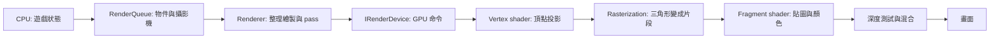
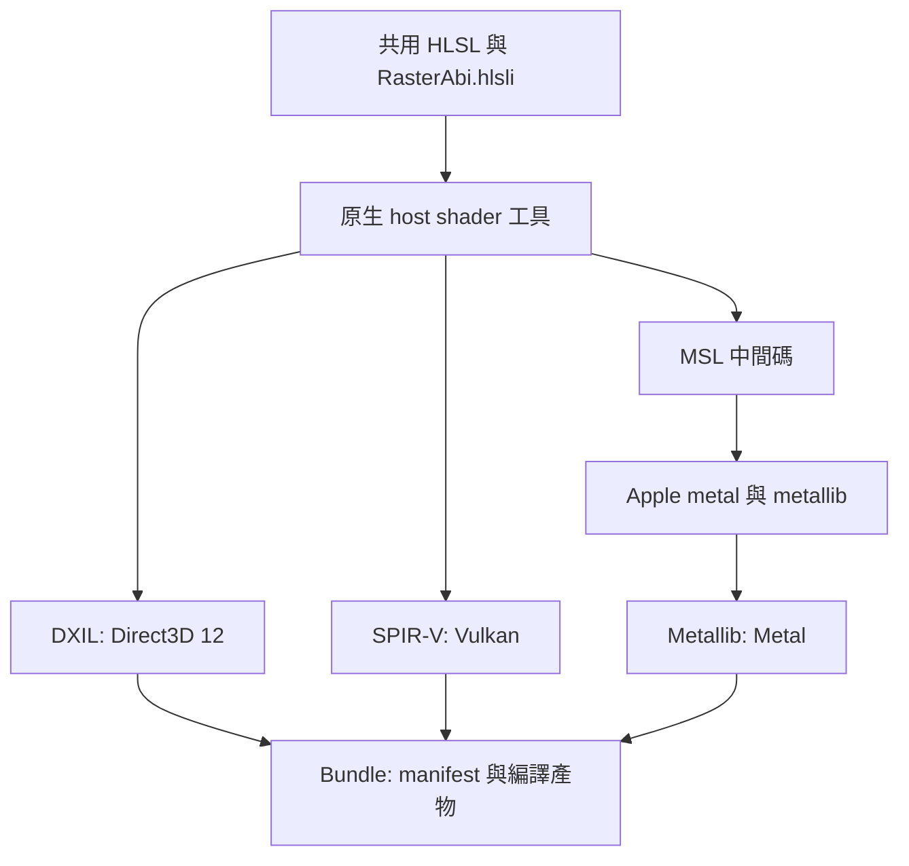
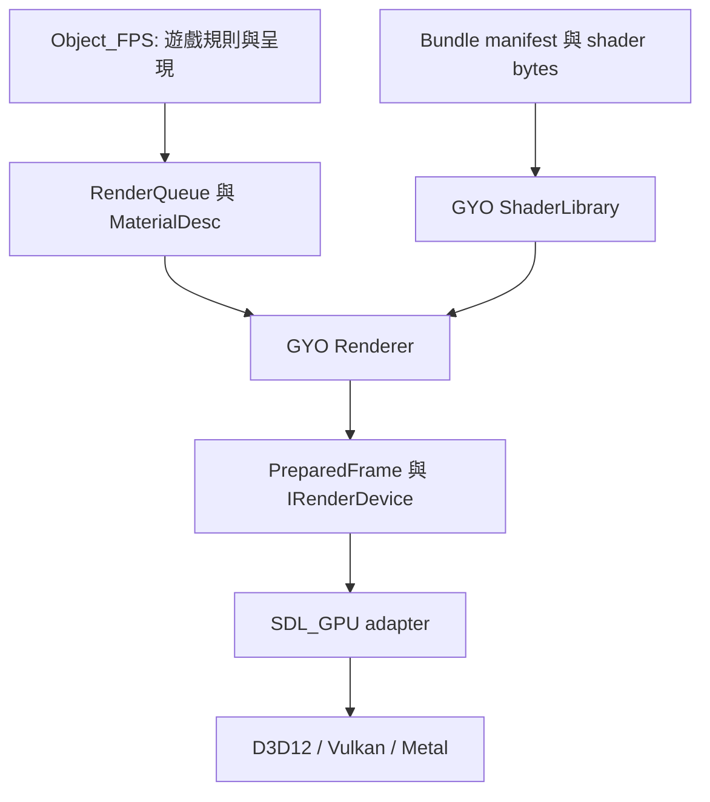

# GYO 渲染架構與跨平台建置

[日本語](rendering_architecture.ja.md) · [整體架構](architecture.md)

兩種語言的章節編號、程式識別字與圖示保持一致。本文描述本次實作的責任邊界；實際驗證狀態見第 10 節。

<a id="r01"></a>
## 1. 先理解一幀怎樣變成畫面

CPU 執行遊戲規則，決定畫什麼；GPU 平行處理頂點和畫面片段。Shader 是 GPU 執行的小程式，並不是整個渲染器。



例如 Mark-23：模型資料先由 CPU 取樣骨骼動畫、執行蒙皮，再更新既有 GPU mesh 的頂點。Vertex shader 把這些頂點轉到螢幕座標；fragment shader 依 UV 取貼圖顏色。深度測試決定手指和槍身誰在前方，背面剔除決定三角形哪一面可見。這些固定管線設定仍由 C++ 的 pipeline 描述管理。

這張圖是概念順序；GPU 可以提早執行部分深度測試。現階段模型蒙皮在 CPU，沒有 GPU 骨骼動畫或完整 PBR 光照。

<a id="r02"></a>
## 2. 同一份 HLSL，產生不同平台格式

HLSL 是原始語言，DXIL、SPIR-V、Metallib 是不同後端接受的編譯產物。GYO 維護共用 HLSL，在建置時產生目標平台需要的檔案；遊戲啟動時不編譯 HLSL。



工具使用固定版本的 DXC、SDL_shadercross、SPIRV-Cross；版本與校驗碼位於 `tools/shader_pipeline/cmake/Dependencies.cmake`。Windows／Linux 使用固定 DXC 發行包，macOS 原生建置固定 DXC 原始碼，再透過所選 Xcode 的工具產生 Metallib。MSL 是建置中間產物，不能把產出 MSL 誤記為已完成 Metal GPU 驗證。

Shader 工具屬於建置主機（host），遊戲屬於執行目標（target）。原生建置會在 build tree 的 `host-tools` 建置工具；交叉編譯必須提供可在主機執行的 `GYO_SHADER_TOOL_EXECUTABLE`。下載、工具、中間碼與 bundle 都留在 build tree。已部署遊戲不需要 DXC、shadercross 或 Xcode。

<a id="r03"></a>
## 3. 責任分配與資料流



| 元件 | 負責 | 不負責 |
|---|---|---|
| Object_FPS | 決定物件、相機、材質 shader ID、武器動作 | SDL_GPU 命令、shader 格式選擇 |
| `RenderQueue`／`MaterialDesc` | 中立的幾何、材質與畫面提交資料 | Native handle 或檔案編譯 |
| `ShaderLibrary` | 原子載入 bundle、驗證 manifest、保存不可變 shader bytes | 建立 GPU pipeline 或紋理 |
| `Renderer` | 攝影機與矩陣、世界／武器／後處理／HUD 順序、pipeline 選用與畫面資源 | 平台驅動細節或遊戲命中規則 |
| `IRenderDevice` | GPU 資源、pipeline、frame 取得／提交、讀回契約 | 理解槍械或場景政策 |
| SDL_GPU adapter | 把中立契約轉成 SDL_GPU 操作與同步 | 組裝遊戲 pass 或內嵌 HLSL 原始碼 |

這是可替換的 C++ API 邊界，尚未承諾跨編譯器的動態外掛 ABI。`ShaderLibrary` 的 CPU 資料可以共用，每個 device 的 GPU handle、pipeline 與在途資源必須分開。

<a id="r04"></a>
## 4. Shader 資料契約：`gyo.raster.v1`

「同一份 HLSL 可編譯」還不夠：CPU 傳的位元組必須正好符合 shader 的讀法。

| 項目 | 契約 |
|---|---|
| 座標 | 左手系，+Y 向上，+Z 向前；矩陣以 row-major 儲存，使用 row vector |
| 頂點 | `Vertex3D`：位置 float3、UV float2；順序及 offset 由固定 vertex layout 定義 |
| 一般頂點 uniform | `worldViewProjection`：64 bytes，vertex 階段邏輯 uniform 槽 0 |
| 一般 fragment 資源 | 一張貼圖與一個 sampler，fragment 階段邏輯槽 0 |
| 一般 fragment uniform | tint、UV scale/offset、alpha 參數：三個 float4，共 48 bytes，fragment 邏輯 uniform 槽 0 |
| 場景後處理 uniform | exposure 與 gamma 位於一個 float4，共 16 bytes，fragment 邏輯 uniform 槽 0 |
| 顏色 | 線性 RGB 運算，顏色貼圖使用 sRGB 解碼；最後由 sRGB render target 做顯示轉換 |

`render/shaders/common/RasterAbi.hlsli` 是共用 HLSL 宣告。編譯工具以反射資料檢查已支援介面的資源數量與 uniform 大小，再把契約與格式資料寫入 manifest。版本不符、缺少程式、格式不完整、重複 ID 或非法路徑都應明確失敗，不能默默改用別的 shader。

共用宣告使用邏輯資源巨集，不在公開 ABI 寫死 SDL register／descriptor 規則。工具的 SDL_GPU profile 注入實際映射：vertex uniform 為 `b0/space1`，fragment texture／sampler 為 `t0/space2`／`s0/space2`，fragment uniform 為 `b0/space3`；再處理 SPIR-V／Metal 的對應。更換裝置 adapter 時，物理綁定是工具與 adapter 的責任。

本輪只開放既有 `unlit` 與 `scene_post` 介面。自訂 shader 可以在既有資料契約內改變顏色計算；增加新的頂點屬性、額外 texture 或新的 uniform 意義時，必須一起擴充中立介面、反射驗證與 Renderer 的傳值程式。

<a id="r05"></a>
## 5. 內建與遊戲 shader 的所有權

| Shader ID | 所有者 | 用途 |
|---|---|---|
| `builtin/unlit` | GYO Render | 網格與 sprite 的貼圖、tint、alpha cutoff |
| `builtin/scene_post` | GYO Render | 場景曝光與 gamma |
| `game/object_fps/channel_swap` | Object_FPS | 使用同一 `unlit` 契約的自訂 shader 驗證樣本 |

內建來源位於 `render/shaders/builtin/`，遊戲來源位於 `apps/object_fps/shaders/`。各自有 `bundle.json` 建置規格和獨立 runtime bundle。遊戲增加 shader ID 不需要把遊戲名稱或檔案路徑放進 GYO 後端。

`MaterialDesc` 按 shader ID 指定程式，並提供 texture、tint 與 sampler；shader ID 不是 C++ 函式指標，也不授權 shader 改變遊戲狀態。資料設定只能選擇引擎已支援的介面能力。

例如 `apps/object_fps/shaders/bundle.json` 明確指定各階段入口；省略時預設 `main`：

```json
{
  "version": 1,
  "include_directory": "../../../render/shaders/common",
  "programs": [{
    "id": "game/object_fps/channel_swap",
    "interface": "unlit",
    "vertex": "../../../render/shaders/builtin/unlit.vert.hlsl",
    "vertex_entrypoint": "main",
    "fragment": "channel_swap.frag.hlsl",
    "fragment_entrypoint": "main"
  }]
}
```

原始 HLSL 入口名稱與產物入口不一定相同；例如轉成 MSL 後可能改名。工具把產物的真實入口寫入 runtime manifest，Renderer/device 讀取該值。

<a id="r06"></a>
## 6. 一幀與資源生命週期

```text
World meshes + Scene sprites
        ↓ 保留場景顏色，重新清除深度
ViewModel meshes
        ↓ 場景曝光／gamma
Scene post process
        ↓ 不受場景曝光影響
Overlay / HUD → Present
```

世界與武器使用各自相機；武器 pass 清除深度後，手與槍之間仍正常遮擋。`Renderer` 產生 `PreparedFrame`，device 只執行其中明確描述的 pass、附件與 draw。

`AcquireFrame` 在視窗最小化時可以沒有 frame；成功取得的 token 必須經 `SubmitFrame` 或 `AbandonFrame` 恰好消耗一次。提交使用的 CPU 資料在呼叫期間被消費；後端負責保護尚在 GPU 執行的資源。畫面大小改變時重建對應 render target，清理時先解除 Renderer 的 device 資源，再銷毀 device。

動畫每幀更新固定大小的頂點內容，保留 mesh handle 與 index topology。診斷讀回只在明確請求時等待 GPU，日常呈現不進行這種同步。Scene capture 是曝光／gamma／Overlay 之前的場景資料，並非最終螢幕截圖。

<a id="r07"></a>
## 7. CMake 自動選擇與明確覆寫

| 設定 | 值 | 意義 |
|---|---|---|
| `GYO_RENDER_DEVICE` | `AUTO`／`SDL_GPU`／`NONE` | 選擇 device 實作；`NONE` 用於無 GPU 的建置 |
| `GYO_GPU_DRIVER` | `AUTO`／`D3D12`／`VULKAN`／`METAL` | 部署程式的預設驅動政策 |
| `GYO_SHADER_BUNDLE` | `AUTO` 或格式清單 | 建置並部署哪些 shader 格式，例如 `"DXIL;SPIRV"` |
| `GYO_SHADER_TOOL_EXECUTABLE` | host executable 的絕對路徑 | 覆寫原生 shader 工具，供交叉編譯等情況使用 |

| 目標平台 | `AUTO` 的 shader bundle | 可用驅動 |
|---|---|---|
| Windows | DXIL＋SPIR-V | D3D12、Vulkan |
| Linux | SPIR-V | Vulkan |
| macOS | Metallib | Metal |

CMake 使用 `CMAKE_SYSTEM_NAME` 判斷**目標**平台；preset 的 `hostSystemName` 條件只用來限制 CI 原生建置入口。執行時 `--gpu-driver d3d12|vulkan|metal` 可明確覆寫驅動。AUTO 依可提供的完整 shader 格式與 SDL_GPU 可用驅動選擇；強制指定不可用的驅動必須失敗，不以另一個驅動掩蓋問題。

Windows 的 AUTO bundle 同時包含 DXIL／SPIR-V，因此可以驗證兩種驅動。僅包 DXIL 就不能退回 Vulkan。錯誤的平台／驅動／格式組合會在配置或啟動時被拒絕；CMake 無法預先保證玩家 GPU 與驅動可用。

```sh
# 原生建置：Windows 需先進入 x64 MSVC 開發環境；另需 Ninja。
cmake --preset object-fps
cmake --build --preset object-fps
ctest --preset object-fps
cmake --install build/object-fps --prefix /absolute/path/to/stage

# 無遊戲、無 SDL adapter、無 FBX adapter 的核心建置
cmake --preset core
cmake --build --preset core
ctest --preset core
```

`object-fps` test preset 只執行 `cpu|shader` 標籤；GPU 測試需在具有可用顯示與 GPU 的環境另行執行。`ci-windows`、`ci-linux`、`ci-macos` 明確固定 CI 的編譯器／架構入口。

CLion 可沿用現有 MSVC CMake profile，執行 **Reload CMake Project**，再選擇並執行 `gyo_object_fps` target。原生 shader 工具的子建置沿用該 profile 選定的編譯器與 Ninja 路徑；不必為了散佈 DLL 的偵測重建 IDE profile。

macOS CI 套件的 deployment target 是 **13.3**，遊戲與 Metallib 使用相同值。現有遊戲資料解析使用浮點 `std::from_chars`，Apple 的 libc++ 相容性表列出 macOS 13.3 為其最低版本；不能只因 shader 可編譯就把整個程式標為支援更舊版本。[Apple C++ 支援表](https://developer.apple.com/xcode/cpp/)

<a id="r08"></a>
## 8. 部署與缺少檔案的處理

```text
stage/
├─ bin/
│  ├─ gyo_object_fps[.exe]
│  ├─ gyo_ui_editor[.exe]
│  ├─ assets/common/ + assets/object_fps/
│  ├─ shaders/builtin/manifest.json + shader artifacts
│  └─ shaders/object_fps/manifest.json + shader artifacts
└─ lib/  Linux／macOS 的非系統動態庫（Windows DLL 放在 bin/）
```

啟動以 executable 所在位置解析部署內容，不依賴目前工作目錄。`--validate-package` 不建立視窗或 GPU：驗證部署資產、shader bundle 與讀入流程。CI 會複製到獨立暫存目錄後啟動，再暫時移走 common 資產、內建 shader manifest、遊戲 shader manifest，逐一確認失敗，避免源碼目錄的檔案掩蓋缺漏。

GitHub artifact 使用 tar.gz 保留 Unix 執行權限，附 SHA-256 校驗檔。這是供驗收的原生套件，不包含 macOS 簽章／公證或跨發行版 Linux 相容性承諾。Linux 套件仍使用目標系統的圖形驅動與系統函式庫。

Windows 套件使用 Release／RelWithDebInfo，由 `cmake/GyoMsvcRuntime.cmake` 依選定編譯器的安裝位置找到對應 MSVC 可散佈 DLL，放在 `bin/`，避免依賴 IDE 內附 CMake 的 Visual Studio 版本清單。可用 `GYO_MSVC_REDIST_DIR` 明確指定散佈檔根目錄。若找不到 DLL，開發用 configure／build 仍可進行，只有 release install 會報錯並提示如何補齊。不散佈 Debug CRT；本次套件以 Windows 10+ 的系統 UCRT 為基準。使用者執行遊戲不需要 Visual Studio、shader 編譯器或 SDK。

CI 另用 `dumpbin` 確認 Windows EXE/DLL 引用的 VC runtime 均已打包；Linux 用 `ldd` 檢查 SDL3 從套件 `lib/` 解析；macOS 用 `otool` 檢查相對 install name 與 RPATH。這些是建置機器的檢查工具。Windows 本機執行 `tools/ci/validate_package.py` 時可透過 `--dumpbin /absolute/path/to/dumpbin.exe` 指定工具。

<a id="r09"></a>
## 9. Object_FPS 的實機驗收

GitHub Actions 在 Windows x64／MSVC、Ubuntu 24.04 x64／GCC 14、macOS 15 ARM64／Xcode 16.4 建置完整 Object_FPS、UI editor 與 shader，執行 CPU/headless、shader 與部署檢查。三個 job 相互獨立；一個平台失敗不取消其他平台。工作流程上傳日誌、manifest 與原生套件。

Hosted CI 沒有宣稱 GPU 驗收通過。下載對應套件，解開 tar.gz，在有圖形桌面的目標機器執行：

```sh
python manual_gpu_smoke.py --package /absolute/path/to/gyo-object-fps \
  --driver vulkan --output /absolute/path/to/diagnostics
```

macOS 使用 `--driver metal`，Windows 分別測 `--driver d3d12` 和 `--driver vulkan`。Python helper 逐項執行自訂 shader 紅／藍色讀回、世界、選單、武器、完整換彈，以及 16:9／4:3／21:9 槍口投影 smoke，保留各項 exit code、日誌和診斷影像；每項最多 120 秒。不具有 Python 的電腦也能直接執行 `bin/gyo_object_fps --gpu-driver metal --muzzle-smoke-test --capture-dir /absolute/path/to/captures` 等對應指令。

若受限環境無法使用 Python 臨時目錄，可替兩個驗收 helper 加上 `--work-directory /absolute/path/to/new-work`。該目錄必須尚不存在，驗收後會保留供檢查；部署檢查的工作目錄須放在 `--stage` 之外。

另外手動檢查：滑鼠／鍵盤、Space 跳躍、R 換彈、H 收槍／拔槍、手指與槍身遮擋、貼牆射擊、曝光與 HUD、視窗縮放／最小化，以及 UI editor。回報 OS、CPU 架構、GPU／驅動、套件 commit、指定／實際後端與 `summary.json`，才能區分建置、資料和 GPU 問題。

若在目標機器從原始碼建置，可用 `ctest --test-dir build/object-fps -L gpu --output-on-failure` 跑完整 engine＋game GPU 集合。獨立的 `render.sdl_gpu_mesh_smoke` 另以讀回數值檢查 UV／子矩形、深度與剔除、sRGB／線性色彩、alpha、非對稱矩陣，以及 13×7 後處理；此測試 executable 不包含在 Object_FPS 下載套件中。

<a id="r10"></a>
## 10. 驗證狀態、限制與參考

截至 2026-09-16，本次實作的本機證據如下：

| 檢查 | 狀態 |
|---|---|
| Windows 無遊戲／無選用 adapter 的核心配置 | CTest 6/6 通過，包含真實 CMake 平台政策與中立 render 測試 |
| Windows 原生 shader host 工具 | CLion profile 的 CTest 3/3 通過，包含反射、拒絕非法 shader、增量相依、重建與子工具鏈傳遞 |
| 由主建置自動建立 host shader 工具 | 已通過 |
| Windows 完整 RelWithDebInfo 建置與 CPU/headless | 建置通過；CTest 12/12 通過，其中 headless 包含 1,169 個 assertions |
| Windows RelWithDebInfo 的 engine GPU 數值 smoke | 明確指定 D3D12 與 Vulkan 均 exit 0；實際使用 `direct3d12`＋DXIL、`vulkan`＋SPIR-V |
| Windows Object_FPS GPU 驗收 | D3D12 與 Vulkan 各 8/8 案例通過，兩次 helper 均 exit 0 並保存 summary |
| Windows 部署驗收 | 完整套件通過；缺少 common、內建 shader、遊戲 shader 的 3 項負向案例正確失敗；app-local CRT 相依檢查通過 |
| Object_FPS 的 `NONE` 配置 | 指定不存在的 shader 工具仍可建置；43 個 target 無 SDL_GPU、shader host 或 bundle；headless／render 2/2 通過 |
| CLion 既有 MSVC profile | CMake 4.1.2＋Ninja＋VS18 cl 14.51 Release，原 `cmake-build-msvc` 配置、host 工具自動建置、Object_FPS／UI editor 建置通過 |
| CLion 回歸與部署 | CMake 政策／CRT 2/2、headless／render／package／CRT 4/4、遊戲／選單／shader GPU 3/3 通過（`direct3d12`＋DXIL）；release 安裝、隔離套件及 3 項缺檔、CRT 檢查通過 |
| GitHub 三平台 workflow | 尚未執行 |
| Linux／macOS 原生與 GPU 驗收 | 尚待各平台執行 |

既有 Windows Mark-23／跳躍驗收不等同於新渲染架構驗收。請以此次建置日誌、Actions summary 與實機輸出作為具體通過證據。

上述 engine GPU smoke 實際涵蓋 frame 生命週期、動態 mesh、ViewModel 深度、剔除、UV、矩陣投影、alpha 混合與色彩處理。Object_FPS 在兩種驅動、三種寬高比、各 7 組攝影機情境中，槍口／tracer 標記中心差為 0.0000 像素，數值參考投影最大誤差為 0.3823 像素。

本機建置與套件位於 `build/render-cross-vs18`、其 `stage` 子目錄。可重跑 `ctest --test-dir build/render-cross-vs18 -C RelWithDebInfo -L cpu --output-on-failure`，GPU 與部署使用第 8、9 節 helper。此次證據保存於：

- `build/render-cross-vs18/cpu-tests.xml`，同目錄的 `gpu-d3d12/summary.json`、`gpu-vulkan/summary.json`；GPU 子目錄同時保留各案例日誌與 BMP。
- `build/render-cross-vs18/package-logs/package-*.log`：完整套件、三項缺檔與 CRT 相依檢查。
- `build/render-cross-vs18/validation-none-{configure,build,ctest,restore}.log`：停用後端及恢復 AUTO 的檢查。
- `build/render-neutral-vs18/test-results.xml`、`build/shader-host-vs18/Testing/Temporary/LastTest.log`：獨立核心與 host 工具驗收。
- `build/clion-configure.log`、`build/clion-build.log`、`build/clion-regression-tests.log`、`build/clion-host-tests.log`、`build/clion-gpu-tests.xml`、`build/clion-package-logs/`：既有 CLion profile 的修正驗收。

本輪範圍包含共用 HLSL、離線 shader bundle、中立 Renderer/device 邊界與三平台建置流程。Compute shader、GPU skinning、PBR、任意 material graph、shader hot reload、完整 RenderGraph、device-loss 自動復原，以及二進位外掛 ABI 均未納入。

- [SDL_GPU device 與 shader 格式](https://wiki.libsdl.org/SDL3/SDL_CreateGPUDevice)
- [SDL_GPU shader 資源綁定規則](https://wiki.libsdl.org/SDL3/SDL_CreateGPUShader)
- [SDL_shadercross](https://github.com/libsdl-org/SDL_shadercross)
- [DXC](https://github.com/microsoft/DirectXShaderCompiler)
- [CMake target system](https://cmake.org/cmake/help/latest/variable/CMAKE_SYSTEM_NAME.html)
- [GitHub hosted runner 規格](https://docs.github.com/en/actions/reference/runners/github-hosted-runners)
- [Apple Metal Toolchain 安裝](https://developer.apple.com/documentation/xcode/downloading-and-installing-additional-xcode-components)
