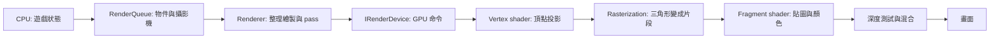
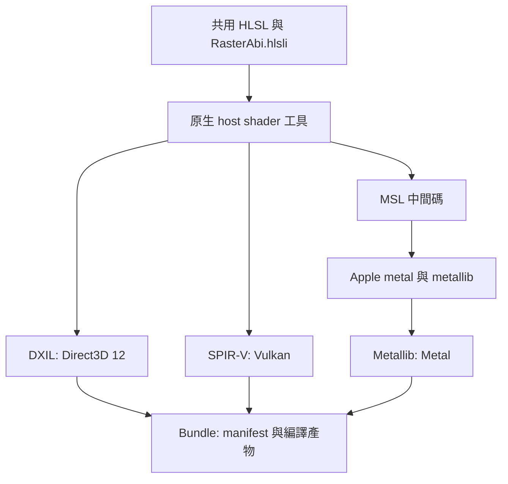
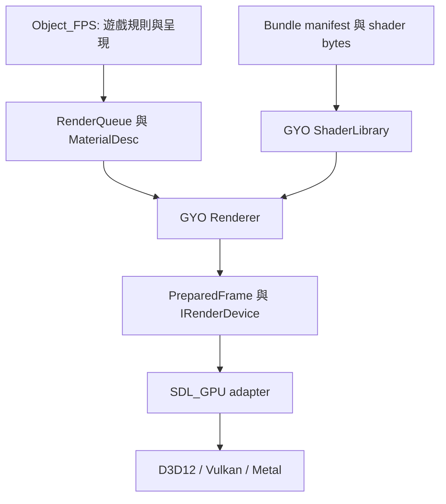

# GYO 渲染架構與跨平台建置

[日本語](rendering_architecture.ja.md) · [整體架構](architecture.md)

兩種語言的章節編號、程式識別字與圖示保持一致。本文描述本次實作的責任邊界；實際驗證狀態見第 10 節。

<a id="r01"></a>
## 1. 先理解一幀怎樣變成畫面

CPU 執行遊戲規則，決定畫什麼；GPU 平行處理頂點和畫面片段。Shader 是 GPU 執行的小程式，並不是整個渲染器。



例如 Mark-23：模型資料先由 CPU 取樣骨骼動畫、執行蒙皮，再更新既有 GPU mesh 的頂點。Vertex shader 把這些頂點轉到螢幕座標；fragment shader 依 UV 取貼圖顏色。深度測試決定手指和槍身誰在前方，背面剔除決定三角形哪一面可見。這些固定管線設定仍由 C++ 的 pipeline 描述管理。

這張圖是概念順序；GPU 可以提早執行部分深度測試。現階段模型蒙皮在 CPU，沒有 GPU 骨骼動畫或完整 PBR 光照。

<a id="r02"></a>
## 2. 同一份 HLSL，產生不同平台格式

HLSL 是原始語言，DXIL、SPIR-V、Metallib 是不同後端接受的編譯產物。GYO 維護共用 HLSL，在建置時產生目標平台需要的檔案；遊戲啟動時不編譯 HLSL。



工具使用固定版本的 DXC、SDL_shadercross、SPIRV-Cross；版本與校驗碼位於 `engine/render/shaders/pipeline/cmake/Dependencies.cmake`。Windows／Linux 使用固定 DXC 發行包，macOS 原生建置固定 DXC 原始碼，再透過所選 Xcode 的工具產生 Metallib。MSL 是建置中間產物，不能把產出 MSL 誤記為已完成 Metal GPU 驗證。

Shader 工具屬於建置主機（host），遊戲屬於執行目標（target）。原生建置會在 build tree 的 `host-tools` 建置工具；交叉編譯必須提供可在主機執行的 `GYO_SHADER_TOOL_EXECUTABLE`。下載、工具、中間碼與 bundle 都留在 build tree。已部署遊戲不需要 DXC、shadercross 或 Xcode。

<a id="r03"></a>
## 3. 責任分配與資料流



| 元件 | 負責 | 不負責 |
|---|---|---|
| Object_FPS | 決定物件、相機、材質 shader ID、武器動作 | SDL_GPU 命令、shader 格式選擇 |
| `RenderQueue`／`MaterialDesc` | 中立的幾何、材質與畫面提交資料 | Native handle 或檔案編譯 |
| `ShaderLibrary` | 原子載入 bundle、驗證 manifest、保存不可變 shader bytes | 建立 GPU pipeline 或紋理 |
| `Renderer` | 攝影機與矩陣、世界／武器／後處理／HUD 順序、pipeline 選用與畫面資源 | 平台驅動細節或遊戲命中規則 |
| `IRenderDevice` | GPU 資源、pipeline、frame 取得／提交、讀回契約 | 理解槍械或場景政策 |
| SDL_GPU adapter | 把中立契約轉成 SDL_GPU 操作與同步 | 組裝遊戲 pass 或內嵌 HLSL 原始碼 |

這是可替換的 C++ API 邊界，尚未承諾跨編譯器的動態外掛 ABI。`ShaderLibrary` 的 CPU 資料可以共用，每個 device 的 GPU handle、pipeline 與在途資源必須分開。

<a id="r04"></a>
## 4. Shader 資料契約：`gyo.raster.v1`

「同一份 HLSL 可編譯」還不夠：CPU 傳的位元組必須正好符合 shader 的讀法。

| 項目 | 契約 |
|---|---|
| 座標 | 左手系，+Y 向上，+Z 向前；矩陣以 row-major 儲存，使用 row vector |
| 頂點 | `Vertex3D`：位置 float3、UV float2；順序及 offset 由固定 vertex layout 定義 |
| 一般頂點 uniform | `worldViewProjection`：64 bytes，vertex 階段邏輯 uniform 槽 0 |
| 一般 fragment 資源 | 一張貼圖與一個 sampler，fragment 階段邏輯槽 0 |
| 一般 fragment uniform | tint、UV scale/offset、alpha 參數：三個 float4，共 48 bytes，fragment 邏輯 uniform 槽 0 |
| 場景後處理 uniform | exposure 與 gamma 位於一個 float4，共 16 bytes，fragment 邏輯 uniform 槽 0 |
| 顏色 | 線性 RGB 運算，顏色貼圖使用 sRGB 解碼；最後由 sRGB render target 做顯示轉換 |

`engine/render/shaders/common/RasterAbi.hlsli` 是共用 HLSL 宣告。編譯工具以反射資料檢查已支援介面的資源數量與 uniform 大小，再把契約與格式資料寫入 manifest。版本不符、缺少程式、格式不完整、重複 ID 或非法路徑都應明確失敗，不能默默改用別的 shader。

共用宣告使用邏輯資源巨集，不在公開 ABI 寫死 SDL register／descriptor 規則。工具的 SDL_GPU profile 注入實際映射：vertex uniform 為 `b0/space1`，fragment texture／sampler 為 `t0/space2`／`s0/space2`，fragment uniform 為 `b0/space3`；再處理 SPIR-V／Metal 的對應。更換裝置 adapter 時，物理綁定是工具與 adapter 的責任。

本輪只開放既有 `unlit` 與 `scene_post` 介面。自訂 shader 可以在既有資料契約內改變顏色計算；增加新的頂點屬性、額外 texture 或新的 uniform 意義時，必須一起擴充中立介面、反射驗證與 Renderer 的傳值程式。

<a id="r05"></a>
## 5. 內建與遊戲 shader 的所有權

| Shader ID | 所有者 | 用途 |
|---|---|---|
| `builtin/unlit` | GYO Render | 網格與 sprite 的貼圖、tint、alpha cutoff |
| `builtin/scene_post` | GYO Render | 場景曝光與 gamma |
| `game/object_fps/channel_swap` | Object_FPS | 使用同一 `unlit` 契約的自訂 shader 驗證樣本 |

內建來源位於 `engine/render/shaders/builtin/`，遊戲來源位於 `assets/object_fps/shaders/source/`。各自有 `bundle.json` 建置規格和獨立 runtime bundle。遊戲增加 shader ID 不需要把遊戲名稱或檔案路徑放進 GYO 後端。

`MaterialDesc` 按 shader ID 指定程式，並提供 texture、tint 與 sampler；shader ID 不是 C++ 函式指標，也不授權 shader 改變遊戲狀態。資料設定只能選擇引擎已支援的介面能力。

例如 `assets/object_fps/shaders/source/bundle.json` 明確指定各階段入口；省略時預設 `main`：

```json
{
  "version": 1,
  "include_directory": "../../../../engine/render/shaders/common",
  "programs": [{
    "id": "game/object_fps/channel_swap",
    "interface": "unlit",
    "vertex": "../../../../engine/render/shaders/builtin/unlit.vert.hlsl",
    "vertex_entrypoint": "main",
    "fragment": "channel_swap.frag.hlsl",
    "fragment_entrypoint": "main"
  }]
}
```

原始 HLSL 入口名稱與產物入口不一定相同；例如轉成 MSL 後可能改名。工具把產物的真實入口寫入 runtime manifest，Renderer/device 讀取該值。

遊戲的 `assets/<name>/content.json` 宣告 catalog 與 shader bundles；CMake 透過共通 hook 自動呼叫資產組裝與離線編譯。組裝結果位於 `build/target/<name>/bin/assets/<name>/`，包含 `shaders/builtin` 與 `shaders/game`。Runtime 只讀取這一個資產根，部署 manifest 不含 build-only source 路徑，也不回退至 checkout。手動複製遊戲時保留內部 shader ID 與 ABI，見[建立遊戲](creating_apps.md)。

<a id="r06"></a>
## 6. 一幀與資源生命週期

```text
World meshes + Scene sprites
        ↓ 保留場景顏色，重新清除深度
ViewModel meshes
        ↓ 場景曝光／gamma
Scene post process
        ↓ 不受場景曝光影響
Overlay / HUD → Present
```

世界與武器使用各自相機；武器 pass 清除深度後，手與槍之間仍正常遮擋。`Renderer` 產生 `PreparedFrame`，device 只執行其中明確描述的 pass、附件與 draw。

`AcquireFrame` 在視窗最小化時可以沒有 frame；成功取得的 token 必須經 `SubmitFrame` 或 `AbandonFrame` 恰好消耗一次。提交使用的 CPU 資料在呼叫期間被消費；後端負責保護尚在 GPU 執行的資源。畫面大小改變時重建對應 render target，清理時先解除 Renderer 的 device 資源，再銷毀 device。

動畫每幀更新固定大小的頂點內容，保留 mesh handle 與 index topology。診斷讀回只在明確請求時等待 GPU，日常呈現不進行這種同步。Scene capture 是曝光／gamma／Overlay 之前的場景資料，並非最終螢幕截圖。

<a id="r07"></a>
## 7. 建置選擇

`engine/config/projects.csv` 的 enabled 與平台欄位決定遊戲集合；`GYO_APPS=AUTO` 使用全部選中遊戲，空值不建遊戲，明確清單只能選擇符合 CSV 的子集。各產品 `project.json` 宣告 optional components，根建置先收集需求再建立同一份 engine graph。遊戲 CMake 不再執行 discovery pass 或維護資產規則。

| 設定 | 值與用途 |
|---|---|
| `GYO_RENDER_DEVICE` | `AUTO`／`SDL_GPU`／`NONE`；選中必要 GPU 遊戲時不能用 `NONE` |
| `GYO_GPU_DRIVER` | `AUTO`／`D3D12`／`VULKAN`／`METAL`；產品的預設 driver |
| `GYO_SHADER_BUNDLE` | `AUTO` 或格式清單，如 `DXIL;SPIRV` |
| `GYO_SHADER_TOOL_EXECUTABLE` | 已建置、可在 host 執行的 compiler 絕對路徑 |

Windows AUTO 產生 DXIL 與 SPIR-V；Linux 產生 SPIR-V；macOS 產生 Metallib。Metallib 需要原生 macOS 與 Apple Metal tools；部署最低版本與 app 一致。Host compiler 與 target compiler 保持分離。

```sh
cmake --preset dev -DGYO_APPS=object_fps -DGYO_BUILD_UI_EDITOR=OFF
cmake --build --preset dev --target gyo_object_fps
cmake --preset core
cmake --build --preset core
ctest --preset core
```

Build cache 位於 `build/target/_build/<preset>`；可執行遊戲在 `build/target/<game>/bin`。舊 cache 不搬移或覆寫。預先準備 runtime 資產與 catalog 是作者工作，之後本機／CI build 都自動組裝內容與編譯 shader。

<a id="r08"></a>
## 8. 產品與部署

引擎靜態連結進遊戲與工具。各遊戲獨立擁有 `bin/assets/<game>`，包含所需 builtin shader，不依賴 `assets/common` 或包外 shader 目錄。Native runtime libraries 由共通產品部署處理。

Product manifest 是 `share/gyo/products/<product>/manifest.json`，記錄 product/kind、executables、必要檔案與檢查。Game archive 為 `gyo-<game>-<platform>.tar.gz`，toolchain archive 為 `gyo-toolchain-<platform>.tar.gz`；各自只有一個對應根目錄。遊戲包不含 UI editor、CI scripts、tests 或 diagnostic executable。

`build/acceptance/<game>` 產生獨立 acceptance executable；`build/acceptance/common` 與 project 專屬 adapter 從產品外部執行檢查。測試暫存副本可把 probe 放在 executable 旁，使其使用完全相同的相對資產路徑；probe 不會加入正式 archive。

<a id="r09"></a>
## 9. Engine 整合與驗收

每個支援平台固定建置 engine＋GUI UI editor toolchain，再加入 CSV 選中的 games。沒有遊戲仍有 toolchain 產物，可以成功 Prepare Release；任何必要產品或平台失敗、取消或跳過，都不能準備 Draft。沒有 Engine SDK 或 source archive。

Quick 與 Release 使用同一產品與資產組裝流程，產品驗收深度由外部 contract 決定。Linux toolchain job 固定使用 Xvfb／Lavapipe 驗證共通引擎 GPU 渲染，沒有 app 時也執行；遊戲 job 另執行 contract 宣告的 GPU checks。這是軟體 Vulkan 證據，不是實體 GPU 驗證。Windows/macOS hosted 結果也不能取代實機測試。

Object_FPS 的 startup/headless/GPU probe 位於獨立 `gyo_<game>_acceptance`，不注入遊戲 `main`。遊戲執行檔保留正常遊戲操作與 `--gpu-driver`；診斷、截圖、互動 viewmodel preview 由外部 tests／design tool 擁有。詳見 [Object_FPS 驗收](object_fps/acceptance.zh-Hant.md)及[版本發佈](releasing.zh-Hant.md)。

<a id="r10"></a>
## 10. 驗證狀態、限制與參考

以下保留 2026-09-16 舊建置配置的歷史證據，未用來宣稱本次 CSV／app 矩陣通過。舊 Object_FPS `NONE` 配置已由新的必要 GPU 宣告取代；目前選中此 app 並設定 `NONE` 會配置失敗。

截至 2026-09-16，本次實作的本機證據如下：

| 檢查 | 狀態 |
|---|---|
| Windows 無遊戲／無選用 adapter 的核心配置 | CTest 6/6 通過，包含真實 CMake 平台政策與中立 render 測試 |
| Windows 原生 shader host 工具 | CLion profile 的 CTest 3/3 通過，包含反射、拒絕非法 shader、增量相依、重建與子工具鏈傳遞 |
| 由主建置自動建立 host shader 工具 | 已通過 |
| Windows 完整 RelWithDebInfo 建置與 CPU/headless | 建置通過；CTest 12/12 通過，其中 headless 包含 1,169 個 assertions |
| Windows RelWithDebInfo 的 engine GPU 數值 smoke | 明確指定 D3D12 與 Vulkan 均 exit 0；實際使用 `direct3d12`＋DXIL、`vulkan`＋SPIR-V |
| Windows Object_FPS GPU 驗收 | D3D12 與 Vulkan 各 8/8 案例通過，兩次 helper 均 exit 0 並保存 summary |
| Windows 部署驗收 | 完整套件通過；缺少 common、內建 shader、遊戲 shader 的 3 項負向案例正確失敗；app-local CRT 相依檢查通過 |
| Object_FPS 的 `NONE` 配置 | 指定不存在的 shader 工具仍可建置；43 個 target 無 SDL_GPU、shader host 或 bundle；headless／render 2/2 通過 |
| CLion 既有 MSVC profile | CMake 4.1.2＋Ninja＋VS18 cl 14.51 Release，原 `cmake-build-msvc` 配置、host 工具自動建置、Object_FPS／UI editor 建置通過 |
| CLion 回歸與部署 | CMake 政策／CRT 2/2、headless／render／package／CRT 4/4、遊戲／選單／shader GPU 3/3 通過（`direct3d12`＋DXIL）；release 安裝、隔離套件及 3 項缺檔、CRT 檢查通過 |
| 本次 CI 相容性修正的本機回歸 | Windows Object_FPS 與 host 工具重建通過；CMake／render／headless／package／GPU 合計 7/7、host 3/3；CSV 專項在 MSVC 與 MinGW GCC 各 192 assertions 通過 |
| GitHub Windows x64 | 先前完整 CI 通過；最新 quick run 35097049659 的建置、安裝與 startup 通過，但 MSVC 覆寫 `PLATFORM=x64` 使 archive 參數失敗。已改用 `GYO_PACKAGE_PLATFORM`，待新 CI |
| GitHub Linux／macOS core-only | 兩平台各 7/7 通過 |
| GitHub Linux 建置與 quick smoke | run 35097049659 成功：建置、部署版 startup、Lavapipe 單項 shader 渲染與封裝；先前 XTest／console-build 問題已解決 |
| GitHub macOS 完整建置 | run 35093916457 通過：CPU/headless/shader 13/13、host shader 3/3、core-only 7/7、Metallib、安裝與部署；最新 quick run 的 macOS 結果尚未確認 |
| Linux／macOS 實體 GPU 驗收 | 尚待各平台實機執行；Linux 軟體 Vulkan 的 quick smoke 已通過 |
| 新 smoke helper 的案例與錯誤路徑 | 八項真實 subprocess 測試通過：quick 僅渲染一項、非零退出、逾時、無法啟動、未建立 GPU 卻退出 0、driver／shader 不符及結果彙整 |
| 完整 CI helper 與 workflow 靜態檢查 | 49 項 helper 測試通過，包含發佈政策、封裝內容與 smoke；actionlint 1.7.12 與 `git diff --check` 通過 |
| 新 helper 對既有 Windows 套件 | `--suite ci` 在本機 D3D12／DXIL 與 Vulkan／SPIR-V 各 3/3 通過，`--suite quick` 在 Vulkan 1/1 通過；使用既有套件，並非新 hosted 流程的通過證據 |
| 新 Windows 執行檔的 CPU 回歸 | MSVC 重建通過；startup smoke、gameplay headless smoke、package、domain headless 共 4/4 通過。設定無效 SDL video／GPU driver，確認這些路徑不依賴視窗或 GPU |
| 新 Windows 安裝套件驗收 | 從 TEMP 工作目錄執行 startup／gameplay smoke 通過；部署正向與缺少 common／builtin shader／game shader 三項負向結果正確；Vulkan `full` 8/8、D3D12 `quick` 1/1 通過 |
| CI／Release 流程 | 先前 quick 路徑已有 hosted 記錄；本次共用驗證流程與 GUI Prepare Release／Draft 建立尚待新的 GitHub 執行驗證 |

既有 Windows Mark-23／跳躍驗收不等同於新渲染架構驗收。請以此次建置日誌、Actions summary 與實機輸出作為具體通過證據。

首輪 hosted 記錄為 [Actions run 35079389797](https://github.com/yojinn-io/GYO-Engine/actions/runs/35079389797)。該次執行的是修正前 commit；重新執行舊 job 仍會使用舊版本，需將修正提交並推送後，由新 commit 觸發驗收。

後續記錄為 [Actions run 35093916457](https://github.com/yojinn-io/GYO-Engine/actions/runs/35093916457)：Windows 與 [macOS job](https://github.com/yojinn-io/GYO-Engine/actions/runs/35093916457/job/104786488372) 成功，macOS 包含 Metallib、完整測試與部署檢查；Linux 日誌確認離線 SDL 的 console-build 設定缺失。這兩次都是新 quick／Release 流程落地前的歷史證據；macOS 實體 GPU 仍未驗證。

最新 [quick run 35097049659](https://github.com/yojinn-io/GYO-Engine/actions/runs/35097049659) 已驗證 Linux startup、shader 渲染與封裝。Windows 的 MSVC 初始化會設定工具鏈用的 `Platform=x64`，而 Windows 環境變數不分大小寫；因此套件識別改用 `GYO_PACKAGE_PLATFORM=windows-x64`，避免污染報告與封裝參數。

上述 engine GPU smoke 實際涵蓋 frame 生命週期、動態 mesh、ViewModel 深度、剔除、UV、矩陣投影、alpha 混合與色彩處理。Object_FPS 在兩種驅動、三種寬高比、各 7 組攝影機情境中，槍口／tracer 標記中心差為 0.0000 像素，數值參考投影最大誤差為 0.3823 像素。

Windows 平台變數修正已在本機初始化 MSVC 後，直接執行 workflow 的 startup／archive 區塊驗證；封裝名稱、內嵌平台資料與 SHA-256 均通過。記錄位於 `build/ci-platform-env-check/result.log`，GitHub 修正後結果仍待新 commit 的 CI。

本機建置與套件位於 `build/render-cross-vs18`、其 `stage` 子目錄。可重跑 `ctest --test-dir build/render-cross-vs18 -C RelWithDebInfo -L cpu --output-on-failure`，GPU 與部署使用第 8、9 節 helper。此次證據保存於：

- `build/render-cross-vs18/cpu-tests.xml`，同目錄的 `gpu-d3d12/summary.json`、`gpu-vulkan/summary.json`；GPU 子目錄同時保留各案例日誌與 BMP。
- `build/render-cross-vs18/package-logs/package-*.log`：完整套件、三項缺檔與 CRT 相依檢查。
- `build/render-cross-vs18/validation-none-{configure,build,ctest,restore}.log`：停用後端及恢復 AUTO 的檢查。
- `build/render-neutral-vs18/test-results.xml`、`build/shader-host-vs18/Testing/Temporary/LastTest.log`：獨立核心與 host 工具驗收。
- `build/clion-configure.log`、`build/clion-build.log`、`build/clion-regression-tests.log`、`build/clion-host-tests.log`、`build/clion-gpu-tests.xml`、`build/clion-package-logs/`：既有 CLion profile 的修正驗收。
- `build/ci-portability-build.log`、`build/ci-portability-tests.xml`、`build/ci-portability-host-tests.xml`：本次 Linux／macOS CI 相容性修正的 Windows 回歸；原失敗日誌在 `build/ci-35079389797-logs/`。
- `build/ci-35093916457-linux.log`：後續 hosted Linux 的離線 SDL console-build 配置錯誤。
- `build/ci-35093916457-macos.log`：後續 hosted macOS 的建置、Metallib、13/13＋3/3＋7/7 測試與部署成功記錄。
- `build/ci-smoke-support/windows-{d3d12,vulkan}/summary.json`：新 helper 對既有 Windows 部署包的三項診斷。
- `build/ci-smoke-support/windows-vulkan-quick/summary.json`：新 quick suite 的單項 shader 渲染。
- `build/ci-release-smoke-tests.log`、`build/ci-release-smoke-tests.xml`：新 Windows 執行檔的 4/4 CPU 回歸；新安裝套件位於 `build/ci-release-stage/`。
- `build/ci-release-gpu/vulkan/summary.json`、`build/ci-release-gpu/d3d12-quick/summary.json`：新安裝套件的本機 Vulkan 八項與 D3D12 單項渲染驗收，尚不代表 Linux Lavapipe 通過。

本輪範圍包含共用 HLSL、離線 shader bundle、中立 Renderer/device 邊界與三平台建置流程。Compute shader、GPU skinning、PBR、任意 material graph、shader hot reload、完整 RenderGraph、device-loss 自動復原，以及二進位外掛 ABI 均未納入。

- [SDL_GPU device 與 shader 格式](https://wiki.libsdl.org/SDL3/SDL_CreateGPUDevice)
- [SDL_GPU shader 資源綁定規則](https://wiki.libsdl.org/SDL3/SDL_CreateGPUShader)
- [SDL_shadercross](https://github.com/libsdl-org/SDL_shadercross)
- [DXC](https://github.com/microsoft/DirectXShaderCompiler)
- [CMake target system](https://cmake.org/cmake/help/latest/variable/CMAKE_SYSTEM_NAME.html)
- [GitHub hosted runner 規格](https://docs.github.com/en/actions/reference/runners/github-hosted-runners)
- [Apple Metal Toolchain 安裝](https://developer.apple.com/documentation/xcode/downloading-and-installing-additional-xcode-components)
